---
output:
  pdf_document: default
  html_document: default
---

```{r message=FALSE, warning=FALSE, include=FALSE}
knitr::opts_chunk$set(echo = FALSE)
library(bookdown)
library(svglite)
library(knitr)
library(kableExtra)
```

# DL Classification of Weather Patterns over Europe {#sm}

*Author: Ziyu Mu, Laura Schlueter*

*Supervisor: Henri Funk*

*Degree: Master*

## Abstract

Daily weather in the mid-latitudes is dominated by large-scale atmospheric circulation types (CTs), which influence regional climate variability and extremes. 
Accurate classification of these CTs is crucial for diagnosing long-term climate dynamics and analysing future changes. This study implements and extends a novel deep learning-based classification method for European CTs, building on the Hess & Brezowsky (HB) framework.

Using a convolutional neural network (CNN) architecture (inspired by applications in climate science and optimization techniques from), we trained the model on high-resolution ERA5 reanalysis data (1950–1980), with sea-level pressure (SLP) and geopotential height at 500 hPa (z500) fields as key predictors. To ensure robustness, a nested cross-validation approach was employed, achieving an overall accuracy of 53.17% and a macro F1 score of 55.14%, outperforming traditional classification methods.

Applied to the CanESM2 ensemble projections, which simulate observed past climate, our results show significant future frequency shifts in CTs, notably an increase in Icelandic High, Cyclonic (HNZ) occurrences during both summer and winter half-years. This methodological advancement not only enhances classification accuracy but also offers robust ensemble analyses critical for climate-informed decision-making.

## Introduction

In the mid latitudes, daily weather is dominated by large-scale atmospheric circulation patterns, 
defined by the position of high and low pressure centres [@Hackel2021; @Mittermeier2022]. 
Due to steep temperature and pressure gradients along the frontal zone between polar and tropical air masses (around 45° latitude), 
the jet stream is formed in about 10 km altitude. 
It is characterized by mean wind speeds of 300 km/h and the long-term average wind direction is westerly [@Hackel2021]. 
Here, dynamic high and low pressure systems develop [@Hackel2021; @Mittermeier2022]. 
However, the westerly jet stream is not stationary, but deflected with varying amplitude creating the so-called Rossby waves, 
which influence the position of high and low pressure systems [@Hackel2021]. 
While an infinite number of atmospheric conditions would be conceivable, recurrent weather patterns with similar meteorological features are observed in practice. 
Therefore, it is possible to classify weather patterns according to synoptic properties [@Bissolli2001b].

The first concept for a classification of different weather patterns was introduced by @Baur1944. 
They used surface pressure charts from 1881 to 1939 and assigned the respective weather situation to a specific class for each day based on the spatial distribution of atmospheric pressure and the position of the frontal zones. 
This lead to a classification into 21 Grosswetterlagen for Europe and East Atlantic [@Baur1944]. 
In 1963 Baur defined Grosswetterlage as the mean spatial air pressure distribution of a large area, at least the size of Europe, over a period of several successive days. 
This classification has been revised and improved several times. In 1977, Hess and Brezowsky published their third edition of a revised catalogue of Grosswetterlagen. 
Here, the authors determined that a Grosswetterlage should only be classified if it can be recognised on at least three successive days. 
Furthermore, the number was extended to 29 different Grosswetterlagen. 
In addition to the surface pressure chart, the classification was also based on the geopotential height in 500hPa [@Bissolli2001; @Bissolli2001b; @Werner2010]. 
In the following, Werner and Gerstengarbe published seven editions of a catalogue of the Grosswetterlagen in Europe with updated data. 
The last edition (2010) covers the years 1881 to 2009 and provides daily information on the Grosswetterlage over Europe. 
Today, the German Weather Service (DWD) still constantly updates the catalogue of European Grosswetterlagen and publishes the results monthly. 
Since 1944, the classification of Grosswetterlagen is conducted by experts, hence it is subjectively biased [@Hess2005katalog]. 
In the following, the classification according to Hess & Brezwosky will be referred to as HB CT.

HB CTs can be attributed to certain weather situation at certain locations in Europe [@Werner2010]. 
Hence in the past, the classification of HB CTs has been used to identify regularities in frequency and duration of occurrences of certain weather conditions. 
@Bissolli2001 describes a relationship between frequency and duration of the HB CTs and mean annual air temperature and precipitation. 
Moreover, extreme weather events—such as heavy rainfall, floods, and heat waves—can often be linked to specific HB CTs [@Mittermeier2022]. 
Such kinds of application could not only be useful to analyse past climate. 
Future climate projections could also be analysed using the HB CTs, allowing conclusions to be drawn about future developments. 
However, analyzing future CTs requires many model ensembles to account for internal variability [@Wyser2021]. 
Manual classification of HB CTs for many ensemble members is no longer possible. 
It is therefore necessary to consider the possibility of automatization [@Mittermeier2022]. 
@Mittermeier2022 have found a way to classify HB CTs automatically using a deep learning classifier.

## Data

### Data Sources

This section describes in detail the datasets utilized for model training, validation, and testing, 
providing comprehensive explanations of their characteristics, purposes, and roles within the study. 
Due to data availability constraints, we replaced the original study’s ERA-20C [@Poli2016] and SMHI-LENS [@Wyser2021] data with 
ERA5 [@ECMWF_ERA5] (higher resolution, 1950–1980) for training and CanESM2 [@Hua2015; @CanESM2] (use only 12 of 50 ensemble members) for projections.

#### Historical Data - Training and Validation

We use reanalysis dataset, which is the historical atmospheric data reconstructed by combining observational data and model simulations, for training and validation.
Data is provided by European Centre for Medium-Range Weather Forecasts (ECMWF).

We only use two variables mentioned above:

1. SLP: Atmospheric pressure measured at Earth's surface, vital for identifying weather systems such as cyclones and anticyclones.
2. z500: Height of the 500 hPa pressure level in the atmosphere, indicative of atmospheric wave patterns and mid-tropospheric dynamics.

Due to reanalysis data's high-quality, accurate, and detailed historical atmospheric representation, it is enabled to get a robust and precise training of the deep learning model.

The difference of ERA5 (Figure \@ref(fig:ERA5)) and ERA-20C (Appendix Figure \@ref(fig:ERA20C)) lies on: 

| Reanalysis Dataset         | Temporal Coverage | Spatial Resolution         |
|:---------------------------|:------------------|:----------------------------|
| ERA-20C (paper)            | 1900–1980          | Approximately 125 km        |
| ERA5 (implementation)      | 1950–1980          | High-resolution, about 31 km |
: Difference between two reanalysis dataset

```{r ERA5,fig.cap = 'Synoptic patterns of the 29 HB CTs created using ERA5 data averaged over the period 1950 - 1980, showing SLP on the left and z500 on the right side.', cache=FALSE, out.width="70%", fig.align="center", echo=FALSE, eval = TRUE}
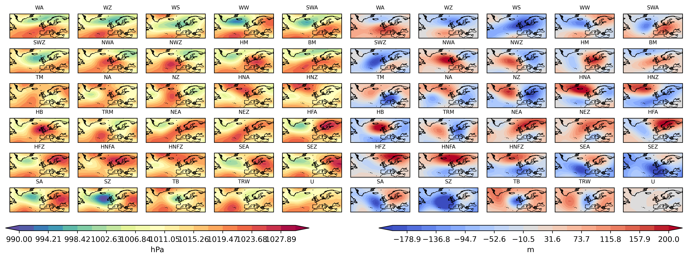
```


#### Future Climate Projections - Change Analysis

We use ensemble datasets which projected future climate conditions under specific scenarios,
to evaluate future changes in atmospheric circulation, considering internal variability, 
essential for accurate and reliable climate change projections. 
The data should be preprocessed with the same variables, scale, domain, resolution as training data.

1. CanESM2 [@CanESM2]
    * Name: CanESM2 (Canadian Earth System Model version 2)
    * Provider: Canadian Centre for Climate Modelling and Analysis (CCCma)
    * Model Used: Climate Model Intercomparison Project phase 5 (CMIP5)
    * Ensemble Members: 50 (due to downloading limitation, we only used 12 ensemble)
    * Scenario: historical, simulate the condition as observed past climate fro, 1850 to at least 2005.
    * Temporal Coverage:
        * Historical Reference: 1971–2000
        * Future Projections: 2031–2060
    * Spatial Resolution: Around 2.8°
    
2. SMHI-LENS [@Wyser2021]
    * Name: SMHI-LENS (Swedish Meteorological and Hydrological Institute Large Ensemble)
    * Provider: Swedish Meteorological and Hydrological Institute
    * Model Used: EC-Earth3 (Climate Model Intercomparison Project phase 6, CMIP6)
    * Ensemble Members: 50 (to effectively capture internal variability)
    * Scenario: SSP3-RCP7.0, representing a high GHG emission pathway
    * Temporal Coverage:
        * Historical Reference: 1991–2020
        * Future Projections: 2071–2100
    * Spatial Resolution: Around 0.7°
     
As a result with higher greenhouse gas emission under SSP3-RCP7.0 scenario, and with a more distant future in the paper:

1. Future warming and circulation shifts might be more pronounced than our implementation.
2. Frequency changes in HB CTs may appear larger in the paper, simply because the climate change signal is stronger.

### Data Preprocessing Steps

1. Reset spatial domain: only use data in Europe and the North Atlantic region (30°N–75°N latitude, 65°W–45°E longitude)
2. Spatial Regridding: All datasets were interpolated to a common 5° grid resolution, ensuring consistency and computational efficiency
3. Seasonal Centering: Applied to remove seasonal biases, helping the model better recognize atmospheric patterns independently of seasonal influences.

## Models and Training

### CNN Architecture

The classification model used in this study is based on a CNN, 
specifically designed to handle the image-like structure of atmospheric data (SLP and z500). 
The CNN architecture (Figure \@ref(fig:network)) comprises:

1. Input Layer: Two separate input channels corresponding to SLP and z500.
2. Convolutional Layers: Two convolutional layers applied to extract spatial patterns and features from input atmospheric fields. These layers use convolutional kernels to identify local and spatially coherent patterns.
3. Dropout Layer: Included for regularization to mitigate overfitting by randomly dropping out units during training, thus improving the model's generalization.
4. Fully Connected Layers: Two fully connected layers following the convolutional and dropout layers, used for integrating learned spatial features into final predictions of HB CTs.
5. Output Layer: Outputs softmax probabilities for each of the 29 HB CTs, which are then converted into classifications.

```{r network,fig.cap = 'Schematic diagram of the CNN network', cache=FALSE, out.width="70%", fig.align="center", echo=FALSE, eval = TRUE}
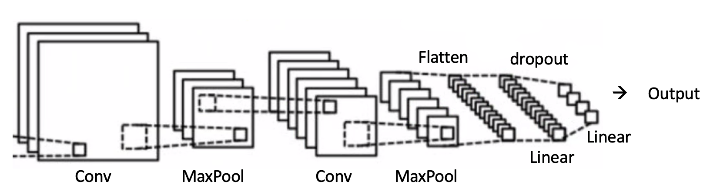
```

### Training Protocol

#### Adam Optimizer
Adam (Adaptive Moment Estimation) [@Mehta2019] is an optimization algorithm widely used for training neural networks. 
It combines the benefits of two other methods—AdaGrad [@Ward2020], which adapts the learning rate for each parameter, 
and RMSProp [@Zou2019], which considers the exponentially decaying average of squared gradients—to adjust the learning rates adaptively during training.

Adam optimizer efficiently handles noisy and sparse gradients, common in deep learning tasks, 
facilitating faster convergence and better handling of large parameter spaces typical of CNNs. 
This makes Adam particularly suitable for our CNN-based classification model, ensuring effective and efficient training.

#### Bayesian Optimization for Hyperparameter Tuning

To achieve an optimal configuration of hyperparameters for our CNN, we employed Bayesian optimization [@Garnett2023], 
specifically using the Tree-structured Parzen Estimator (TPE) method [@Ozaki2022] implemented in the Optuna library. 
Bayesian optimization is particularly suited for deep learning hyperparameter tuning due to its efficiency and ability to intelligently balance exploration and exploitation of the hyperparameter space, thus significantly reducing computational cost compared to grid or random search.

Specifically, the following hyperparameters were optimized:

1. Learning Rate:
The learning rate controls the magnitude of updates to the network weights during training. We allowed this hyperparameter to vary logarithmically between $10^{-4}$ and $10^{-2}$, enabling the optimizer to effectively explore both subtle and more substantial updates in network parameters.
2. Weight Decay:
Serving as a regularization term to prevent overfitting, the weight decay was also sampled on a logarithmic scale ranging from $10^{-5}$ to $10^{-3}$. This enabled fine control over model complexity and encouraged better generalization.
3. Dropout Rate:
Dropout prevents overfitting by randomly dropping neurons during training, forcing the model to learn robust representations. We tuned dropout rate uniformly within a range from 0.2 to 0.6, allowing optimization of the model’s regularization intensity.
4. Convolutional Layer Parameters:
    * Number of Output Channels in First Convolutional Layer (out_channels1):
Chosen categorically from [4, 8, 16], optimizing the depth and feature extraction capability of initial convolutional operations.
    * Number of Output Channels in Second Convolutional Layer (out_channels2):
Selected from [8, 16, 32], further refining the network’s capability to learn hierarchical spatial patterns.
    * Kernel Size:
Kernel size impacts the spatial context the model considers when learning features. We considered kernel sizes of [3, 5, 7], balancing between capturing detailed local patterns and broader spatial structures.
    * Fully Connected Layer Size:
The number of neurons in the fully connected layer was chosen from [32, 64, 128], directly influencing the model’s ability to integrate learned spatial features into higher-level abstractions suitable for classification.

The Bayesian optimization was performed over 100 trials, systematically exploring these hyperparameters. 
Each trial evaluated a distinct combination of parameters based on validation accuracy. 
The final selection of hyperparameters was determined by the combination that produced the highest validation accuracy, 
ensuring the CNN model’s optimal performance on unseen data while minimizing the computational burden associated with hyperparameter tuning.

#### Nested Cross-Validation

Nested cross-validation [@Zhong2023] involves two cross-validation loops:

1. Outer Loop: Evaluates the generalization performance of the model on independent test sets.
2. Inner Loop: Used for hyperparameter tuning and model selection within each training fold.

We use 5 folds of outer loop and 5 folds of inner loop.

#### Epochs and Early Stopping

Training was set to a maximum of 35 epochs, with early stopping criteria implemented, patience of 6 epochs without improvement, 
to prevent overfitting and reduce training time.

### Predicting Technique

#### Ensemble Learning

Ensemble learning [@Dietterich2002] combines predictions from multiple models to enhance predictive performance. 
In this case, multiple CNN models trained with different initial conditions.
A deep ensemble of 30 independently trained CNN models, each initialized with different random weights, is utilized.

Predictions from individual CNN models are aggregated using a weighted averaging method, where each model's contribution is proportional to its validation performance.
This enhances robustness, reduces prediction uncertainty, and provides stable and reliable classification results by capturing a wider range of atmospheric variability.

#### Transitional Smoothing

According to the definition, a HB CT must last at least three days [@Hess1952] to represent a stable atmospheric pattern.
Without enforcing this constraint, the raw neural network predictions may contain short, noisy transitions that are meteorologically implausible.
Thus, transition smoothing is necessary to:

1. Remove unrealistic, very short-lived classifications.
2. Produce physically consistent and stable time series of HB CTs.
3. Ensure that predictions align with domain-specific expectations.

According to the original paper:

1. Step 1: Identify all transitions where the predicted HB CT lasts fewer than three days.
2. Step 2: Check neighborhood consistency:
    * If the HB CT before and after the short transition is the same, assign this type to the transition days.
3. Step 3: If different types occur before and after:
    * Compare the predicted probabilities (confidence scores) for each neighboring type.
    * Assign the transition days to the neighbor with the higher predicted probability (i.e., stronger membership).

This method ensures that short transitions are corrected in a physically meaningful way, based on both label consistency and model confidence.
Since the original code is not available, our transition_smoothing function follows the paper’s logic but introduces minor adaptations for greater robustness and flexibility:

| Aspect                         | Paper Description                                                      | Our Code Implementation                                                      | Reason for Change                                                                 |
|:-------------------------------|:------------------------------------------------------------------------|:-------------------------------------------------------------------------------|:---------------------------------------------------------------------------------|
| Minimum duration               | 3 days fixed                                                           | min_duration parameter (default=3)                                           | Makes the method flexible for other settings.                                   |
| Neighbor block length trust    | Not specified clearly                                                  | min_neighbor_run_length parameter (default=2)                               | Ensures smoothing only when neighboring segments are stable enough.             |
| Handling first and last segments | Implicitly ignored                                                    | Explicitly handled                                                            | Avoids out-of-bound errors at sequence edges.                                   |
| Probability averaging          | Single-point comparison                                                | Average probability across transition segment                                | More robust by considering entire transition region, not a single timestep.     |
| Fallback behavior when neighbors are not strong | Not detailed                                        | Fallback to the only trusted neighbor if one side is strong enough            | Avoids wrong smoothing when one neighbor is unreliable.                         |
: Transitional smoothing implementation

## Results

### Classification Performance

#### F1-score

The classification performance of our model was evaluated using a confusion matrix, F1-scores per class, 
macro F1-score [@Opitz2019], and overall accuracy [@Alberg2004], following the approach used in the reference study [@Mittermeier2022].
The overall accuracy achieved by our model on the cross-validation test set is 53.17%, and the macro F1-score is 55.14%.
Among all HB CTs (Appendix Figure \@ref(fig:f1score)), the best performing classes in terms of F1-score are WZ (70.21), HM (63.7), and HB (62.78).
These types exhibit distinct spatial patterns, aiding CNN identification.
The lowest F1-scores are observed for classes like NA (33.61) and SEZ (44.37).
These are likely due to class imbalance caused by rare occurrence.
Generally, accuracy for each type is quite high, which may imply overfitting.

The confusion matrix (Appendix Figure \@ref(fig:conf)) shows that most misclassifications occur among HB CTs with similar dynamical structures, consistent with expectations from atmospheric science. Diagonal dominance is visible but moderate, reflecting the challenging nature of this classification task.

Compared to the paper results, which reported an overall accuracy of 41.1% and a macro F1-score of 38.3% [@Mittermeier2022],
our model achieves slightly higher overall accuracy and macro F1-score.

| Metric                | Paper (%) | Our Model (%) |
|:----------------------|:----------|:--------------|
| Macro F1-score         | 38.3      | 55.1          |
| Overall accuracy       | 41.1      | 53.2          |
: Metric comparison

The boxplots of F1-score under each HB CT (Figure \@ref(fig:box); Appendix Figure \@ref(fig:boxpaper)) confirm our conclusion:

1. Original study has considerably lower overall F1-scores (around 0.3–0.5), indicating challenges in reliable classification.
2. Our model demonstrates much higher stability with F1-scores generally between 0.80–0.95, suggesting improved reliability and robustness in identifying circulation patterns.

#### RMSE

To further evaluate the quality of the predictions, the Root-Mean-Square Error (RMSE) between the predicted HB CT composites and the true label composites was calculated for variable SLP. 

Equation for the calculation of the RMSE with I being the predicted image (in our case: signature plot of the deep learning classifier) and K being the reference image (in our case: signature plot of the labels). 
M are number of rows and N the number of columns
of the pictures to compare. 
The RMSE thus compares the pixel-wise values of two images. 
A value of zero indicates a perfect match [@Mittermeier2022; @Mueller2020].
$$\text{RMSE} = \sqrt{\frac{1}{M\times N}\sum_{i=0,j=0}^{M-1,N-1}[I(i,j)-K(i,j)]^2}$$

Additionally, RMSEs for false positives and false negatives were computed separately.

The average RMSE for our implementation’s predictions across all HB CTs is 0.88,
while the false positives and false negatives yielded RMSEs of 1.08 and 1.23, respectively.

| RMSE Category          | Paper | Implementation |
|:-----------------------|:------|:---------------|
| Prediction RMSE        | 0.89  | 0.74           |
| False positives RMSE   | 1.09  | 1.45           |
| False negatives RMSE   | 1.28  | 0.69           |
: RMSE comparison

Our implementation achieves a lower prediction RMSE (0.74) compared to the original paper (0.89) [@Mittermeier2022].
This indicates that, on average, the spatial patterns of the correctly predicted HB CTs are more similar to the true labels in our model than in the reference study.

However, the false positives RMSE is much higher (1.45) than in the paper (1.09) [@Mittermeier2022].
This suggests that when our implementation wrongly predicts a HB CT, 
the resulting spatial pattern is less similar to the true pattern than in the paper.

Our implementation shows a lower false negatives RMSE (0.69) compared to the paper (1.28) [@Mittermeier2022].
This means that when the model misses a true HB CT, 
the spatial signature remains relatively closer to the correct pattern than in the paper.

The overall pattern suggests that:

1. Our implementation is better at maintaining correct structures when making predictions or missing true types.
2. However, when making incorrect predictions (false positives), our implementation model tends to produce worse distortions than the model used in the paper.

### Signature Plot Analysis

Figure \@ref(fig:sig) shows the signature plots for four HB CTs selected based on our RMSE results:

1. Two HB CTs with lowest RMSE: WZ and TRW (best performance)
2. Two HB CTs with highest RMSE: NA and HNFA (worst performance)

For each HB CT, four different composite plots are displayed:

1. Labels: Composite of true labels.
2. Predictions: Composite of model predictions.
3. False Positives: Days predicted as the HB CT but labeled differently.
4. False Negatives: Days labeled as the HB CT but predicted differently.

RMSE values are shown below each panel, comparing each composite to the true label composite.

```{r sig, fig.cap = "Signature plots of four selected circulation patterns at slp. Column 1: labels showing the indicated HB CT, Column 2: deep ensemble predictions showing the indicated HB CT, Column 3: signature pattern, when the deep ensemble predicts the indicated HB CT while labels state differently, Column 4: labels stating the indicated HB CT while deep ensemble predicts differently. The RMSE values are calculated by comparing the respective signature plot to the signature plot of the labels (column 1).", cache=FALSE, out.width="70%", fig.align="center", echo=FALSE, eval = TRUE}
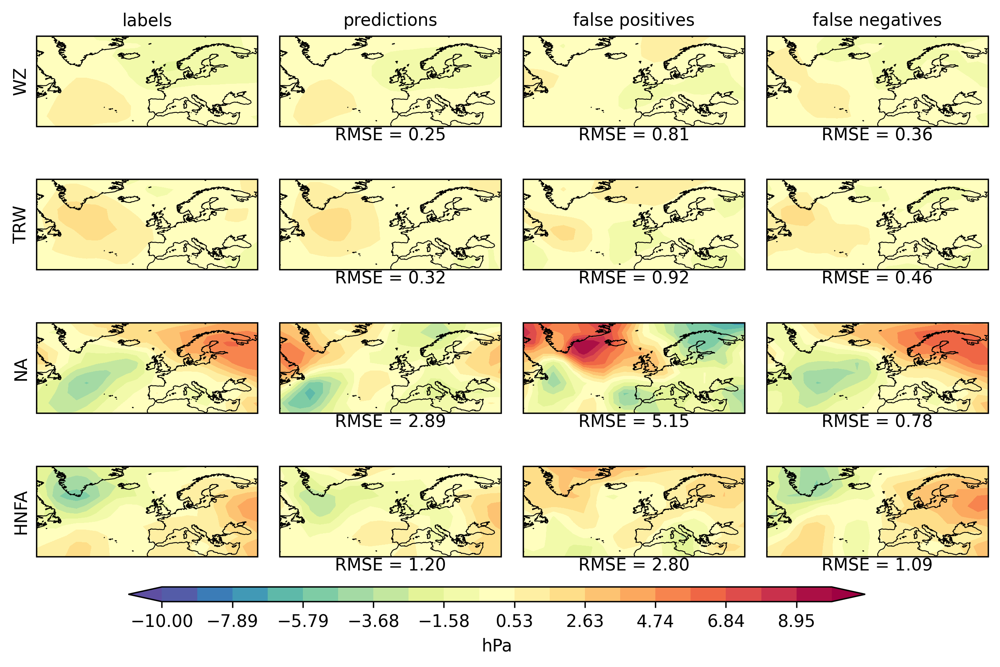
```

Based on our results, we can observe that:

1. WZ:
    *	The predicted composite closely matches the label pattern (RMSE = 0.25).
	  *	False positives and false negatives show moderate RMSE (0.81 and 0.36), indicating stable identification of WZ.
2. TRW:
    *	Predictions for TRW are also accurate (RMSE = 0.32).
    *	False positives (0.92) and false negatives (0.46) suggest TRW is generally recognized reliably.
3. NA:
    *	Predictions for NA have high RMSE (2.89), indicating difficulty in capturing the correct structure.
    *	False positives (5.15) show very large errors, and false negatives (0.78) suggest missing NA patterns is common.
4. HNFA:
    *	Predictions for HNFA also show high RMSE (1.20).
    *	False positives (2.80) and false negatives (1.09) are large, implying HNFA is a difficult type for the model to classify.

Differences from the original paper (Appendix Figure \@ref(fig:sigpaper)) arise primarily from data variations, model differences, and random initialization.

Although the specific CTs selected differ, the general trend remains consistent with the findings of the paper:

1. Some HB CTs are easier to predict (low RMSE), others are harder (high RMSE).
2. False positives tend to have higher RMSE than correct predictions.
3. A larger discrepancy in the color distribution indicates a higher complexity of HB CT, and false negatives vary depending on HB CT complexity.

Thus, while specific HB CTs differ, our results fundamentally agree with the conclusions of the paper that certain patterns are systematically easier or harder to classify, and signature plots are effective to visualize these tendencies.

### Frequency Distribution of HB CTs

Figure \@ref(fig:count) shows the frequency distribution of the 29 HB CTs, expressed as the average number of days per year for the period 1950–1980.
For each HB CT, the frequency derived from the true labels (blue bars) is compared to the frequency derived from the network predictions (yellow bars).

```{r count,fig.cap = 'Frequency distribution of the 29 HB CTs in number of days per year for the training period 1950–1980 (blue) and for predictions of the CNN (yellow).', cache=FALSE, out.width="70%", fig.align="center", echo=FALSE, eval = TRUE}
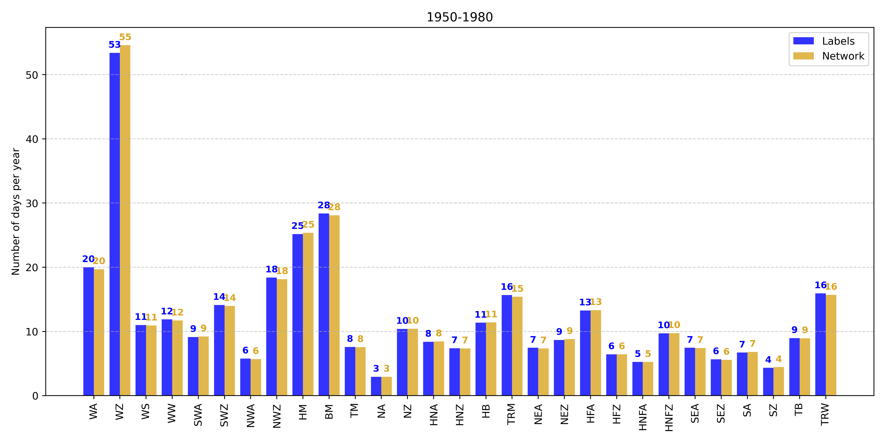
```

Overall, the CNN reliably reproduces observed HB CT frequencies:

1. Dominant HB CTs (e.g., WZ, HM) are captured accurately, reflecting robust model learning.
2. Rarer HB CTs (e.g., NA, SZ) exhibit minor deviations, suggesting challenges in accurately learning patterns due to fewer examples, which may indicate slight overfitting.

In comparison with the original study (Appendix Figure \@ref(fig:countpaper)), despite differences in dataset periods (our study: 1950–1980; original: 1900–1980), frequency patterns remain consistent. Slight discrepancies in rarer HB CTs are likely due to dataset differences, emphasizing the importance of extended or more balanced training datasets for better generalization.

The agreement between the label frequencies and the network predictions, as well as the similarity to the paper’s findings, indicates that our model effectively learns the relative occurrence rates of the different HB CTs.
Overall, the frequency distribution results support the conclusions of the original study, confirming that the network can reliably reproduce the occurrence rates of various HB CTs.

### Future Change

Figure \@ref(fig:boxn) and Figure \@ref(fig:box) show the relative changes in the frequency of occurrence of the 29 HB CTs between the future period (2031–2060) and the historical reference period (1971–2000), for the entire year, winter half-year, and summer half-year, based on 12 climate model realizations.
Figure \@ref(fig:boxn) is the conclusion directly from predicted results, while Figure \@ref(fig:box) is obtained after transition smoothing.
Positive values indicate an increase in occurrence; negative values indicate a decrease.
The lower panels show the F1-scores of the classification model ensemble.
Higher F1-scores indicate better classification stability and reliability.
The grouping by wind direction allows visual comparison of performance across different HB CT categories.

```{r boxn,fig.cap = 'Boxplots of frequency change and f1 score without transitional smoothing. Upper plots show the change in the relative frequency of occurrence (%) of the HB CTs between the future 2031–2060 and the reference period 1971–2000 for the entire year, the winter half-year (ONDJFM) and the summer half-year (AMJJAS).  Lower plots illustrate the spread of F1-scores.', cache=FALSE, out.width="70%", fig.align="center", echo=FALSE, eval = TRUE}
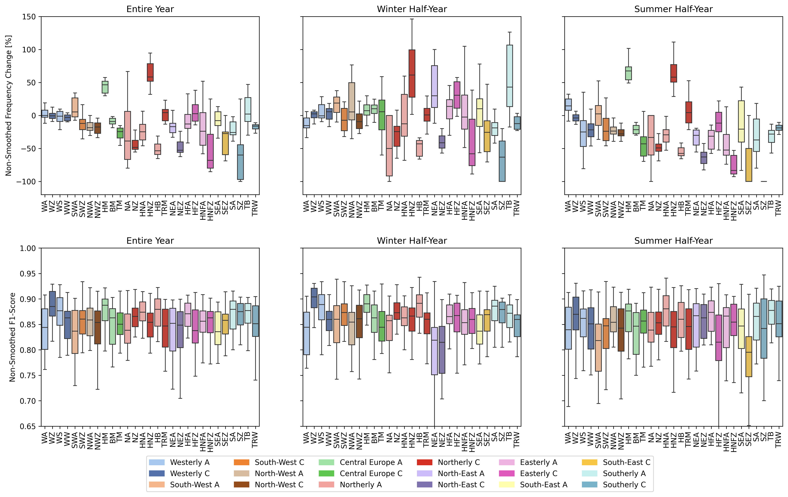
```
  

```{r box,fig.cap = 'Boxplots of frequency change and f1 score after transitional smoothing. Upper plots show the change in the relative frequency of occurrence (%) of the HB CTs between the future 2031–2060 and the reference period 1971–2000 for the entire year, the winter half-year (ONDJFM) and the summer half-year (AMJJAS).  Lower plots illustrate the spread of F1-scores.', cache=FALSE, out.width="70%", fig.align="center", echo=FALSE, eval = TRUE}
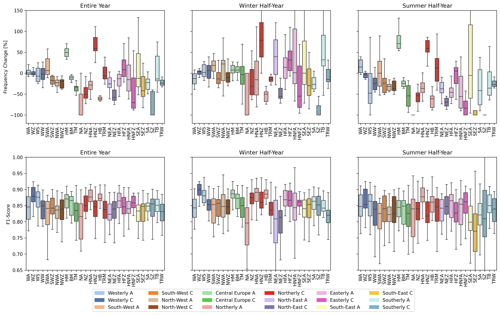
```

Without transition smoothing (Figure \@ref(fig:boxn)):

1. The boxplots show relatively smaller spreads for most HB CTs.
2. Most relative changes are within ±50%.
3. Fewer extreme outliers are observed, and the whiskers are relatively short.
4. The overall signal is dominated by noise, making it hard to detect consistent climate change trends.

With transition smoothing (Figure \@ref(fig:box)):

1. The boxplots show larger spreads, particularly for rare HB CTs.
2. Relative changes frequently extend beyond ±50%, and even approach ±100% in some cases.
3. More extreme outliers appear.
4. F1-score distributions are lower and broader, indicating less stable classification performance.

Overall, transition smoothing, while theoretically beneficial, introduces higher internal variability in our implementation, complicating clear signal identification. 
Variability differences from the original study stem from methodological factors (ensemble size, smoothing implementation) and underlying climate model characteristics.

Our findings reaffirm the value of a multi-ensemble approach and careful consideration of methodological choices when projecting future circulation trends, 
underscoring the need for robust ensemble analysis techniques to better discern climate-driven circulation changes from internal variability.

The original study (Appendix Figure \@ref(fig:boxpaper)) shows relatively controlled variability, mostly within ±50% [@Mittermeier2022], and fewer extreme outliers, indicating relatively stable and moderate shifts in HB CTs.
Our results (Figure \@ref(fig:boxn)) exhibit larger variability, particularly notable in specific HB CTs such as NA, SEA, HNFZ, and SZ, with frequency changes frequently exceeding ±50%, even reaching ±100%.

1. Entire Year:
    *	Original study shows moderate shifts centered around zero, with clear signals for types like WA and SEA [@Mittermeier2022].
	  * Our implementation shows notably higher variability with clear signals (e.g., strong increase in HNZ, HM and significant decreases in HB and NEZ).
2. Winter Half-Year:
	  *	Original study depicts clear moderate increases for WW and HFA with relatively smaller variability [@Mittermeier2022].
	  *	Our data demonstrate significant changes with pronounced variability and stronger extremes, especially in HNZ and rare CTs like NA and SZ.
3. Summer Half-Year:
	  *	Original data indicate mild variability and clear, moderate increases and decreases in specific types (e.g., decreases in HNFZ, increases in WA) [@Mittermeier2022].
	  *	Our results again illustrate increased variability with substantial increases (e.g., HNZ, HM) and decreases (e.g., HB, NEZ).

In both cases, the summer half-year has a greater influence on the entire year, despite the winter half-year showing higher variability.
Rare CTs such as NA and SZ are observed with significant changes. 
It would be interesting to analyze how rare conditions evolve, 
however, due to the unbalanced data, the results are not very reliable.

Key CT Differences:

1. WA (Westerly Anticyclonic):
    *	Our results show only slight increases, with less pronounced signals for WA, especially compared to significant changes in other types.
	  *	Original study consistently shows WA increasing clearly across all seasons [@Mittermeier2022].
2. HNZ (Icelandic High Cyclonic):
	  *	In our results, HNZ consistently shows marked increases, particularly pronounced in the summer and winter half-years.
	  *	Original study presents less dramatic decreasing changes for HNZ, reflecting a critical methodological or scenario-driven difference [@Mittermeier2022].
3. NA and SZ (Northerly Anticyclonic and Southerly Cyclonic):
	  *	Our results exhibit significantly larger variability and extreme reductions in NA, while SZ shows extreme negative changes particularly in summer.
	  *	Original study maintains relatively modest decreasing changes for these types [@Mittermeier2022].

The differences in projected frequency changes between our results and the original study primarily stem from:

1. Time period difference (2031-2060 vs. 2071-2100).
2. Scenario differences: CanESM2 model (historical) in our study vs. original SMHI-LENS (SSP3-7.0).
3. Model and methodological distinctions: Implementation differences (e.g., transitional smoothing, dataset variations, and resolution).
4. Ensemble size effects: Our smaller ensemble size (12 vs. original 50) could amplify internal variability signals.

These differences underline the sensitivity of CT analysis to methodological choices, highlighting the importance of transparent documentation of scenario assumptions and model details to ensure the accurate interpretation and comparability of future climate studies.

## Conclusion and Outlook

In this study, we successfully implemented a CNN-based deep learning approach for classifying large-scale atmospheric CTs over Europe, building upon the established HB framework. 
Using high-resolution ERA5 data for model training, our method achieved an overall accuracy of 53.17% and a macro F1 score of 55.14%, clearly outperforming traditional classification approaches.

Our analysis of future projections based on the CanESM2 model (historical) highlights significant shifts in HB CT frequencies, particularly an increased frequency of certain CTs such as Icelandic High Cyclonic (HNZ) during both summer and winter half-years. Notably, our results differ from previous studies, primarily due to distinct methodological choices such as dataset selection, scenario assumptions, and smoothing techniques. These variations underline the sensitivity of HB CT projections and stress the importance of transparent methodological reporting.

The CNN model effectively learned dominant circulation patterns, yet faced challenges classifying rare or inherently complex CTs. These limitations indicate potential issues of class imbalance and inherent labeling uncertainties associated with manual classifications.

Besides the primary training session and results shown in this report, 
we conducted another model training experiment using a narrower range of hyperparameters. 
The results, are illustrated in the presentation, demonstrated noticeably different classification performance compared to the original setup.

Although the model shows good performance on the current dataset, it is important to note that this does not necessarily guarantee the absence of overfitting. 
In particular, I suspect that the size of the fully connected linear layers may have a stronger influence on performance than initially assumed. 
In earlier experiments, we tuned the fully connected layer size to around 50 dimensions, 
however, in the latest optimization round, where ensemble methods and more extensive hyperparameter tuning were applied, the model consistently favored a dimension size of 128.

Due to limited computational resources, we were unable to perform a more thorough investigation to validate these observations or further optimize the model architecture. Future work should focus on systematically assessing the impact of fully connected layer sizes and further regularization strategies to ensure model robustness and generalization.

For future studies, we recommend quantifying human-level errors in labeling to understand better the impacts of manual classification biases. 
Additionally, models that explicitly capture temporal continuity, such as Deep Hidden Markov Models [@Yu2015] or temporal-aware CNN architectures (e.g., ConvLSTM [@Moishin2021]), 
could enhance prediction accuracy by directly modeling the persistence characteristic inherent in circulation patterns [@Mittermeier2022].

## Appendix

Synoptic patterns of the 29 HB CTs using ERA20C (Figure \@ref(fig:ERA20C))

```{r ERA20C,fig.cap = 'Synoptic patterns of the 29 HB CTs created using ERA-20C data averaged over the period 1900 -1980, showing SLP on the left and z500 on the right side [@Mittermeier2022].', cache=FALSE, out.width="70%", fig.align="center", echo=FALSE, eval = TRUE}
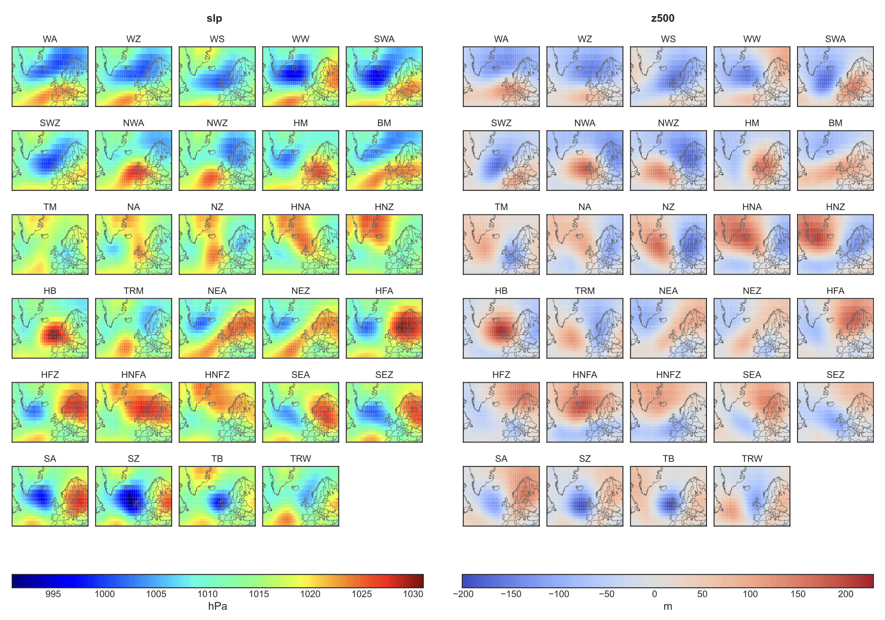
```

HB CTs (Figure \@ref(fig:cts))

```{r cts,fig.cap = 'HB CTs', cache=FALSE, out.width="70%", fig.align="center", echo=FALSE, eval = TRUE}
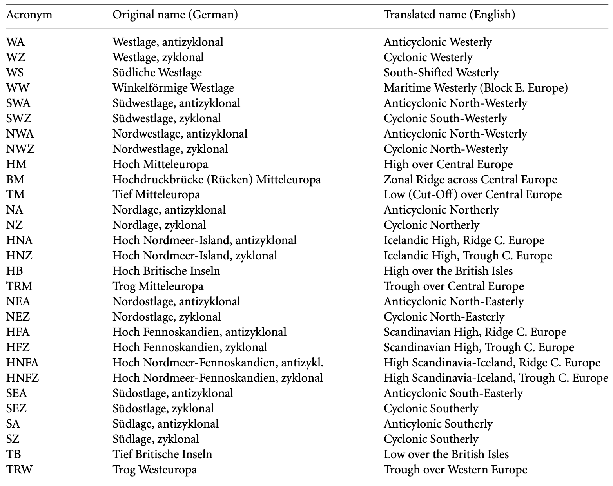
```

F1 score comparison table (Figure \@ref(fig:f1score))

```{r f1score,fig.cap = 'Macro F1', cache=FALSE, out.width="70%", fig.align="center", echo=FALSE, eval = TRUE}
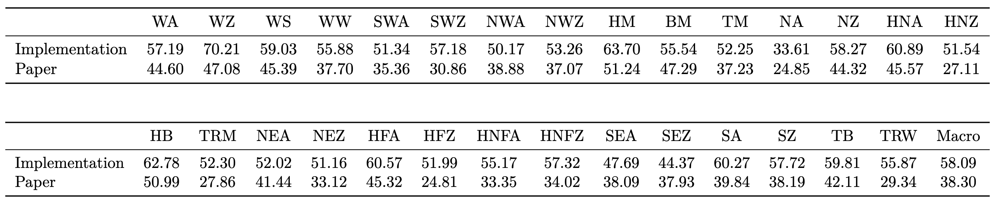
```

Signature plots of paper - SLP (Figure \@ref(fig:sigpaper))

```{r sigpaper,fig.cap = "Signature plots of four selected circulation patterns at slp. Column 1: labels showing the indicated HB CT, Column 2: deep ensemble predictions showing the indicated HB CT, Column 3: signature pattern, when the deep ensemble predicts the indicated HB CT while labels state differently, Column 4: labels stating the indicated HB CT while deep ensemble predicts differently. The RMSE values are calculated by comparing the respective signature plot to the signature plot of the labels (column 1). The four HB CTs are chosen as positive (green) and negative (red) examples [@Mittermeier2022].", cache=FALSE, out.width="70%", fig.align="center", echo=FALSE, eval = TRUE}
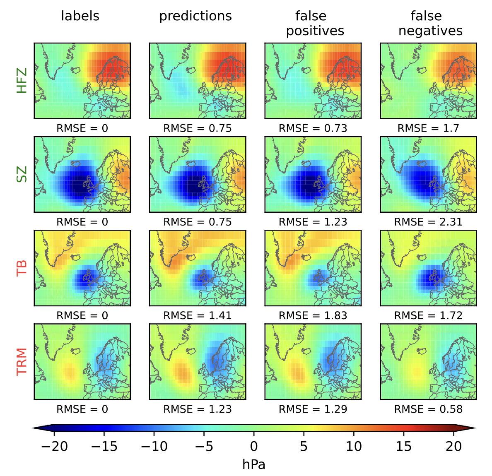
```

Frequency distribution of paper (Figure \@ref(fig:countpaper))

```{r countpaper,fig.cap = 'Frequency distribution of the 29 HB CTs in number of days per year for the training period 1900–1980 (blue) and for predictions of the CNN (yellow) [@Mittermeier2022].', cache=FALSE, out.width="70%", fig.align="center", echo=FALSE, eval = TRUE}
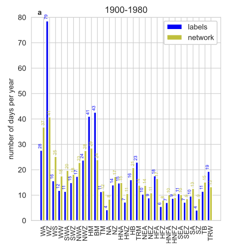
```

Boxplot of future change and  F1 score of paper (Figure \@ref(fig:boxpaper))

```{r boxpaper,fig.cap = 'Boxplots of frequency change and f1 score. Upper plots show the change in the relative frequency of occurrence (%) of the HB CTs between the future 2031–2060 and the reference period 1971–2000 for the entire year, the winter half-year (ONDJFM) and the summer half-year (AMJJAS).  Lower plots illustrate the spread of F1-scores [@Mittermeier2022].', cache=FALSE, out.width="70%", fig.align="center", echo=FALSE, eval = TRUE}
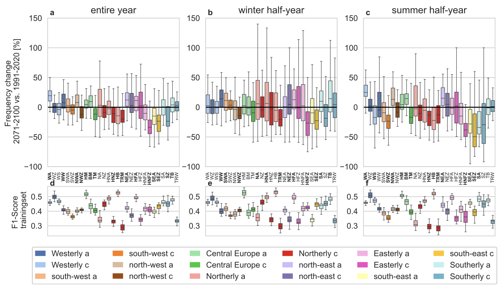
```

RMSE table of our implementation - SLP (Figure \@ref(fig:rmse))

```{r rmse,fig.cap = 'RMSE - slp', cache=FALSE, out.width="70%", fig.align="center", echo=FALSE, eval = TRUE}
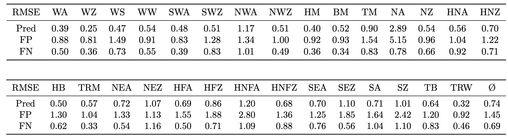
```

RMSE table of paper - SLP (Figure \@ref(fig:rmsepaper))

```{r rmsepaper,fig.cap = 'RMSE - slp', cache=FALSE, out.width="70%", fig.align="center", echo=FALSE, eval = TRUE}
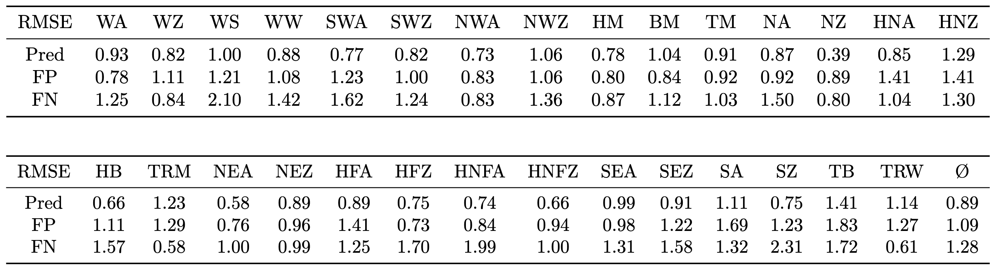
```

Confusion matrix of our implementation (Figure \@ref(fig:conf))
```{r conf,fig.cap = 'Confusion matrix', cache=FALSE, out.width="70%", fig.align="center", echo=FALSE, eval = TRUE}
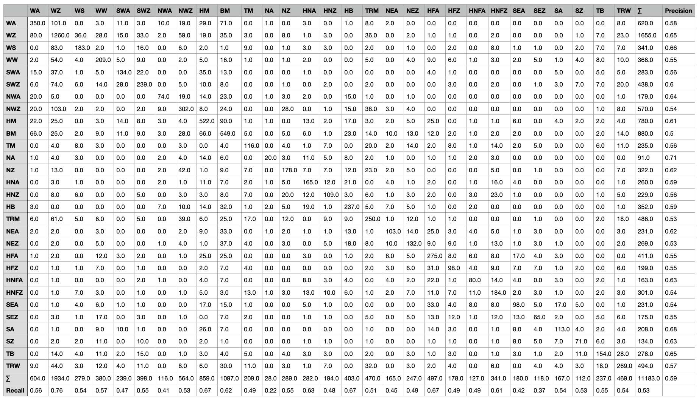
```

Confusion matrix of paper (Figure \@ref(fig:confpaper))

```{r confpaper,fig.cap = 'Confusion matrix', cache=FALSE, out.width="70%", fig.align="center", echo=FALSE, eval = TRUE}
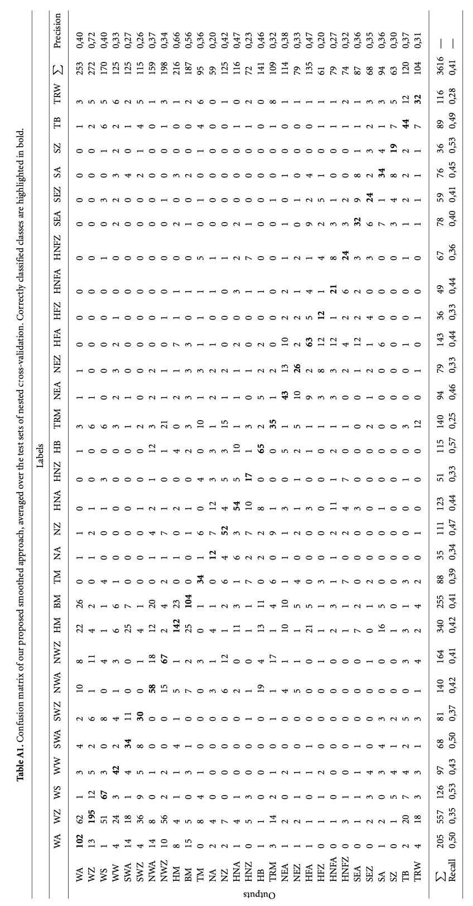
```

Full signature plot of our implementation - SLP (Figure \@ref(fig:sigfull))

```{r sigfull,fig.cap = 'Signature plot', cache=FALSE, out.width="70%", fig.align="center", echo=FALSE, eval = TRUE}
knitr::include_graphics('work/01-weatherpattern/figures/slp_signature_plots_all.png')
```

Full signature plot of paper - SLP (Figure \@ref(fig:sigfullpaper))

```{r sigfullpaper,fig.cap = 'Signature plot', cache=FALSE, out.width="70%", fig.align="center", echo=FALSE, eval = TRUE}
knitr::include_graphics('work/01-weatherpattern/figures/paper/slp_signature_plots_all.png')
```