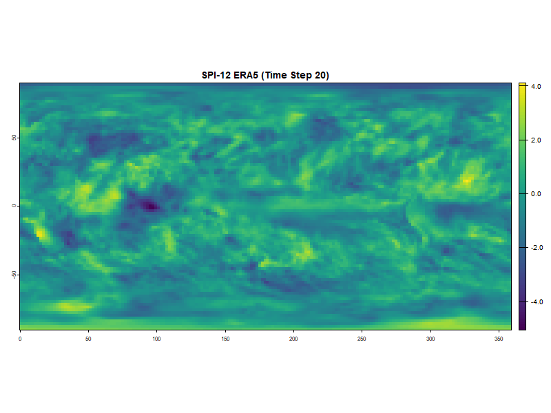
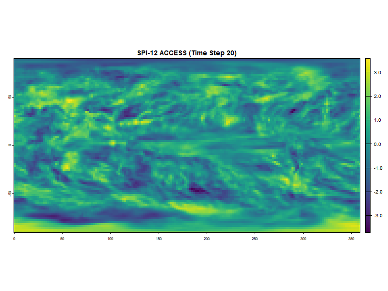
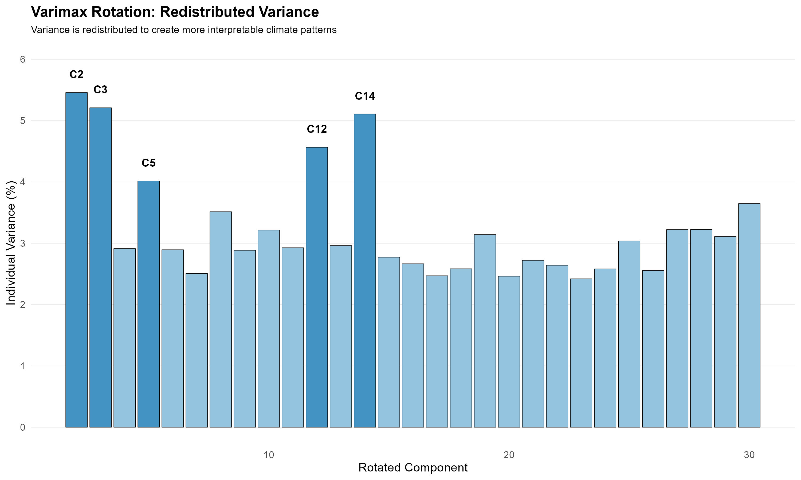
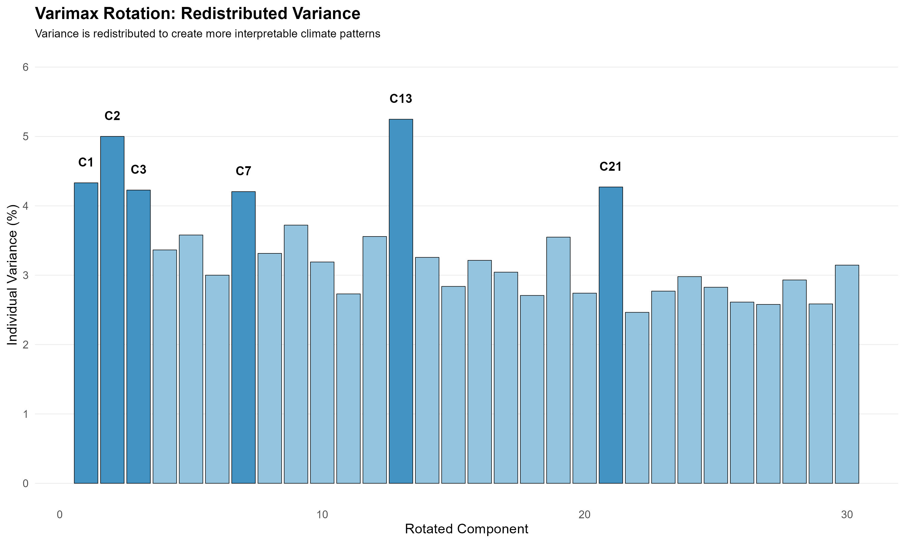
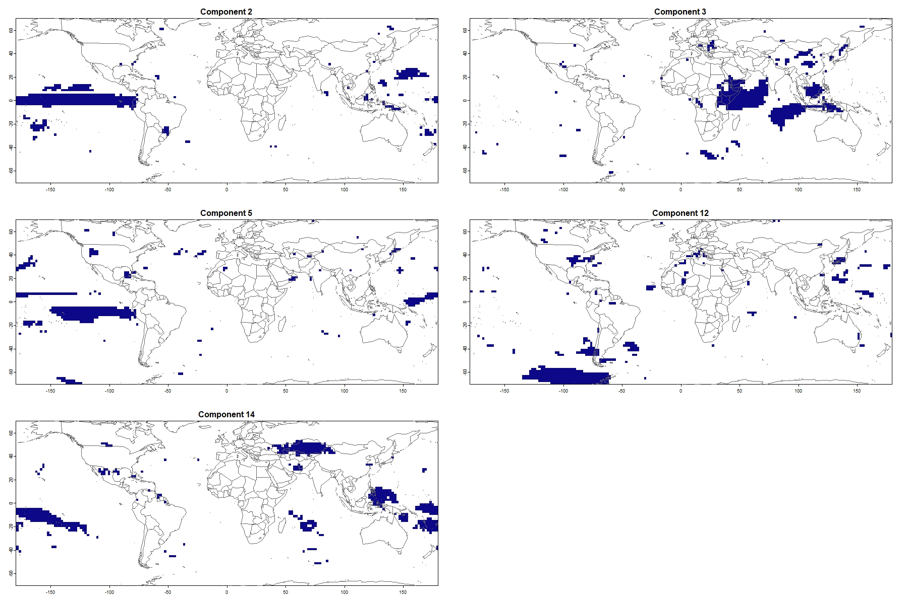
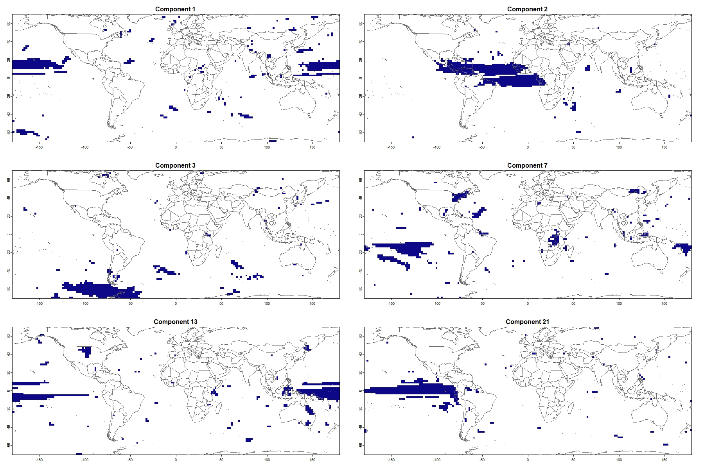
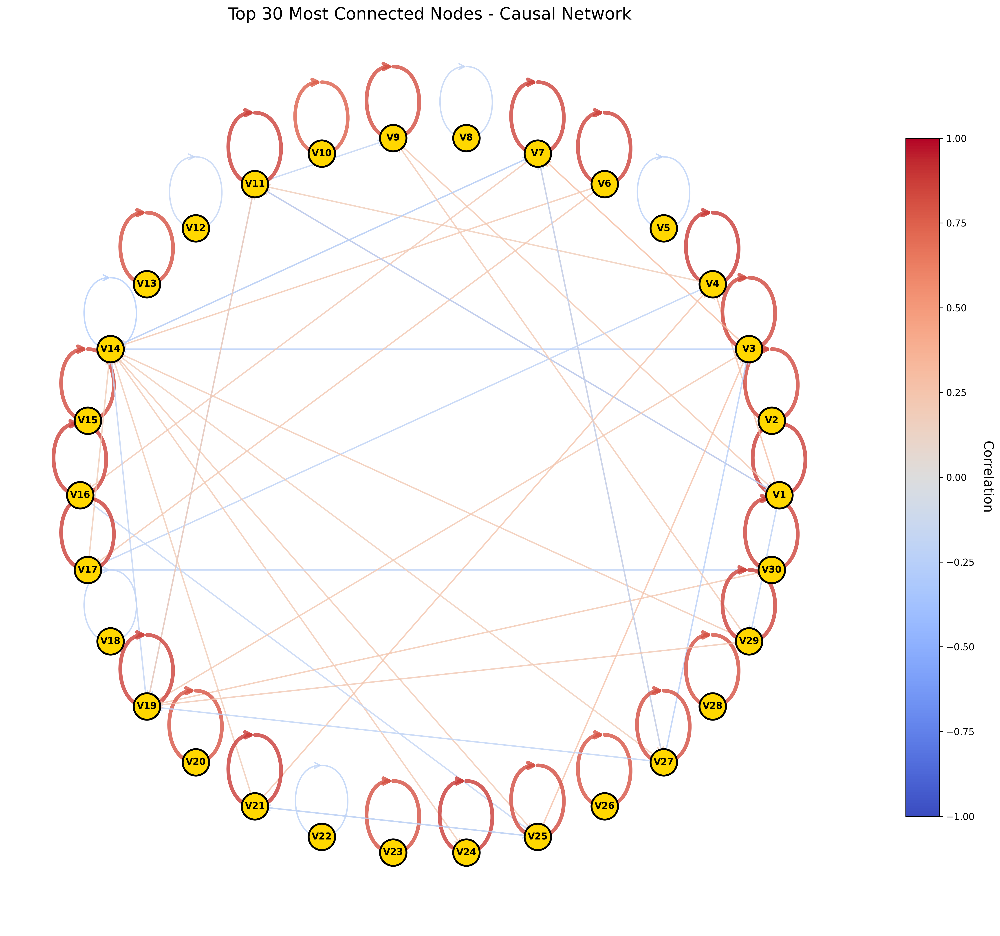
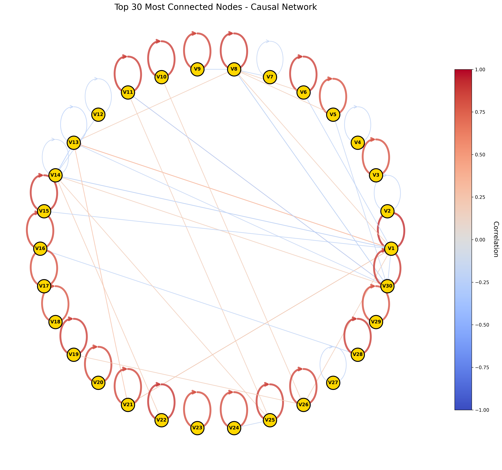
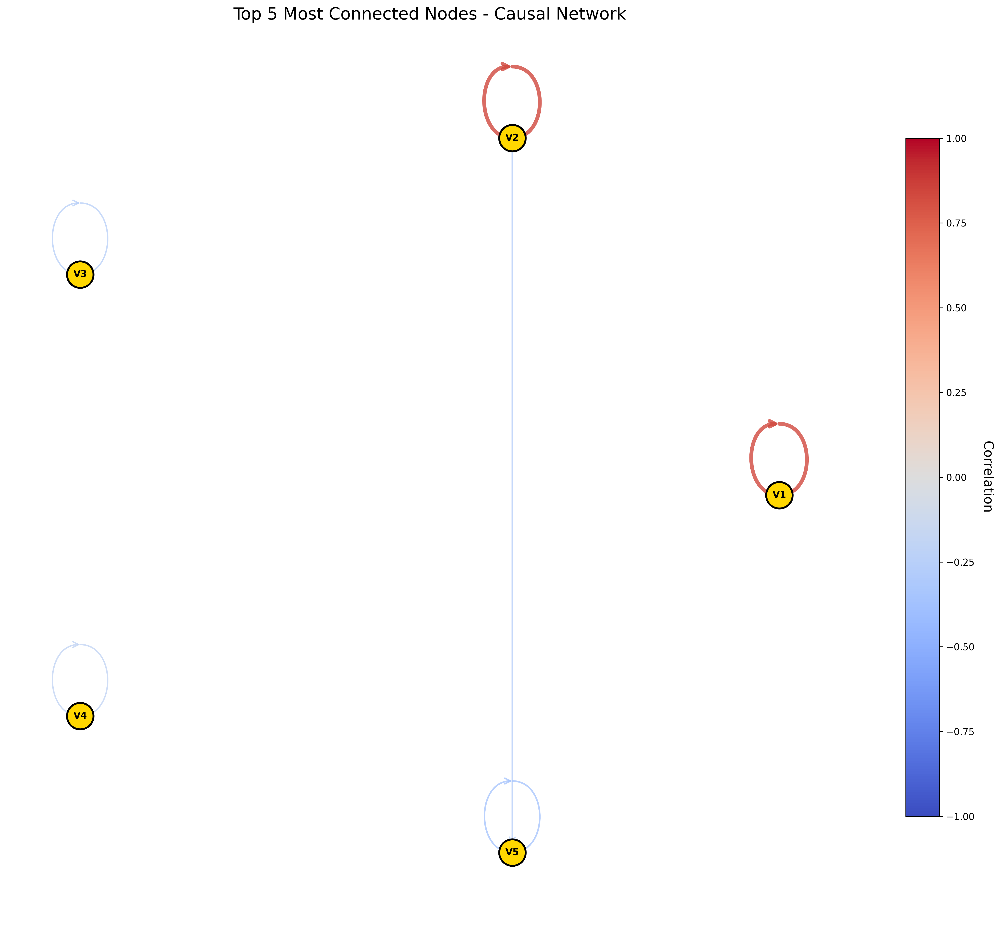
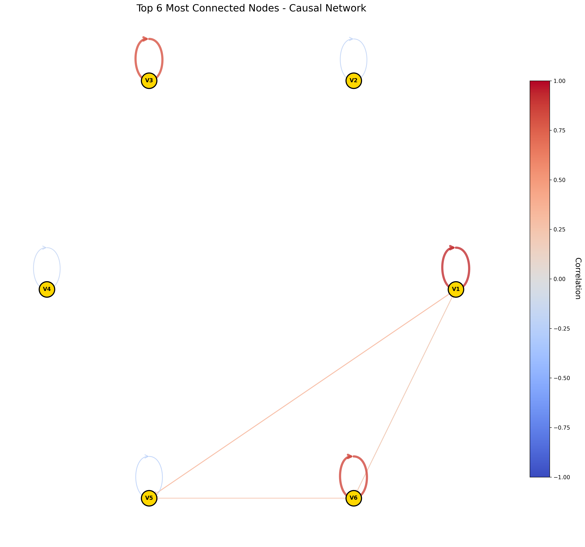

---
output:
  pdf_document: default
  html_document: default
---

# Causal Discovery - Constrain uncertainties in climate projections
```{r, echo=FALSE, include=FALSE, message=FALSE, warning=FALSE}
library(knitr)
library(xfun)
```

*Author:Marta Caserio & Jonas Ameluxen *

*Supervisor: Henri Funk*

## Abstract
Understanding and evaluating the performance of climate models is essential for improving predictions of future climate variability. Traditional evaluation techniques often fall short in identifying deep-seated structural biases in models. This study introduces a novel process-oriented evaluation approach using causal discovery methods, specifically the PCMCI algorithm, to assess global drought teleconnections. By applying the PCMCI algorithm to SPI-12 precipitation indices from both reanalysis (ERA5) and climate model (CSIRO ACCESS ESM 1.5) datasets, we extract causal networks that reveal underlying climate modes and their interactions. A Varimax-rotated principal component analysis (PCA) was used to reduce data dimensionality, and selected components were analyzed to evaluate the consistency between observed and simulated teleconnections. Results highlight significant differences in causal link structures between the datasets, particularly in ocean-dominated climate modes, suggesting that while PCMCI has limitations in physical interpretation, it holds strong potential for comparative climate model diagnostics. Our findings underscore the importance of integrating causal inference tools into the climate model evaluation toolbox to better constrain model uncertainty and improve future projections.

## Introduction to climate models

Understanding our climate system and how it responds to certain external or internal inputs has always been a key part of scientific research. However, due to the high complexity and nonlinearity of a system as large as the earth that operates on timescales from seconds to decades using experimental methods to understand the earth system is not feasible (@edwards2011;@runge2019). For this reason, models have been used to represent, abstract and simplify the most important drivers of the earth system. The earliest beginnings of conceptual climate models can be traced back to ancient scholars like Ptolemy who distinguished different climatic zones based on the maximal daylength and latitude (@edwards2011; @sanderson1999). Complex mathematical climate models started to emerge in the 19th and 20th centuries through scientists like Milutin Milanković who managed to explain a large part of natural climate variability through periodic cycles of earth’s eccentricity, axial tilt and precession (@edwards2011). With the rapid technological and scientific breakthroughs since the 20th century the complexity and accuracy of climate models increased tremendously on one hand through better understanding of the underlying principles but also through collection of decades of observational data from satellites and field measurements [@runge2019].

Modern global climate models can be divided into two subgroups. The first one are general circulation models (GCMs) which simulate the dynamics of atmosphere (AGCM) and oceans (OGCM) following the laws of fluid motion, thermodynamics and momentum conservation (@evaluation2013; @nowack2020). In these models atmosphere and oceans are divided into grid cells for which the dynamical equations describing the evolution of variables like temperature or vapor pressure are solved with numerical methods (@climate2008). An extension to these models are Earth System Models (ESMs) which expand the GCMs by including biogeochemical cycles such as the carbon or nitrogen cycle or atmospheric chemistry (@climate2008).

Anthropogenic climate change has changed Earth’s climate at unprecedented rates. To better understand this change and model future climate pathways the Coupled Model Intercomparison Project (CMIP) was organized by the Working Group on Coupled Modelling (WGCM) in an effort the compare state of the art GCMs and ECMs and tackle important questions regarding climate change ([@eyring2016a]). Over the last 30 years CMIP went through 6 different Phases, each including more models and addressing a wider range of research questions. With its standardized framework CMIP allows detailed multi-model evaluation which, over the years, revealed model specific systemic differences between individual model groups and observations ([@eyring2019]). 	For this reason, rigid climate model evaluation is crucial and has been a rapidly advancing field over the past decades. While more and more routine evaluation metrics and tools like the Earth System Model Evaluation Tool ([@eyring2016b]) using metrics such as means, variances and trend analysis have been developed, these methods often fail to identify underlying model biases ([@nowack2020]). 

A novel approach to constrain uncertainties in climate models is a process-oriented causal model evaluation (CME) approach introduced by [@nowack2020]. This method utilizes causal discovery methods developed by [@runge2019] (Detecting causal associations in large nonlinear time series datasets, Sci. Adv., 5, eaau4996 2019) to systematically exclude common driver effects and indirect links ([@nowack2020]), resulting in a network of causal global connections. [@nowack2020] applied CME to show that inter-model comparison and comparison to observational data of the resulting causal networks can identify biases in climate models and thus help reducing uncertainties for climate predictions.

In this work we introduce the method proposed by [@nowack2020] and show one potential use by applying it to global drought datasets based on reanalysis and global climate model precipitation datasets.

## Process

The use of Causal Networks and especially the PCMCI algorithm, as introduced in the previous section, to help evaluate and better understand large scale climate data timeseries and model outputs has gained some popularity over the last years. One topic where PCMCI algorithms have been applied multiple times are global weather teleconnections. It has been shown multiple times that weather patterns and weather extremes like precipitation and temperature can have significant influence on weather in regions thousands of kilometers aways.
One example of such a long distance weather teleconnection is the impact of the El Niño Southern Oscillation (ENSO) on North American precipitation and weather patterns[@ropelewski1986]. An example of a teleconnection between two hydrometeorological extremes is the 2010 floods in Pakistan that were shown to be connected to a heatwave in western Russia [@lau2012]. In both cases the driver behind these teleconnections were atmospheric wave trains (Rossby Waves) that lead to a hydrometeorological connection between the distant regions (@lau2012; @ropelewski1986). Such teleconnections can work in both directions but can also be one-directional as in the ENSO-North-American case (Detecting causal associations in large nonlinear time series datasets, Sci. Adv., 5, eaau4996 2019). The PCMCI algorithm can be used to help discover or confirm suspected teleconnections, however caution when interpreting such results is necessary. One study used PCMCI to show the significant role global teleconnections play in the synchronization of extreme rainfall events [@boers2019]. 

```{r figure9, fig.cap="SPI-12 patterns on ERA5 reanalysis data showing observed drought patterns.", out.width = "49%", fig.align = "center", echo=FALSE}

```
In this work we will apply the PCMCI algorithm to global standard precipitation index (SPI) datasets to assess drought teleconnections. Introduced in 1993, the SPI is a commonly used measure to define droughts by fitting long-term baseline precipitation values to a probability distribution (usually gamma distribution) and then transforming the probability values into a standard normal variable with μ = 0 and σ=1 (The relationship of drought frequency and duration to time scales 1993). SPI values were calculated based on 12 month cumulative precipitation values (SPI-12) and hence represent long lasting droughts or wet-periods [@chauhan2024]. In a previous study it was shown that especially oceans play a significant role on modulating global droughts [@chauhan2024]. Similar to [@nowack2020] we applied the PCMCI algorithm to a reanalysis dataset and one climate model dataset. The underlying assumption being that the causal network from the reanalysis dataset represents real world teleconnections. Comparing this to the causal network of the climate model can uncover where the model fails or succeeds at reproducing those teleconnections.

```{r figure10, fig.cap="SPI-12 patterns on ACCESS ESM 1.5 climate model simulation.", out.width = "49%", fig.align = "center", echo=FALSE}

```

## Statistical background 

### Principal Component Analysis and Varimax Rotation

Our PCA implementation transforms the high-dimensional SPI-12 data into a set of linearly uncorrelated variables that maximize explained variance. This approach effectively identifies coherent drought patterns across geographical regions while substantially reducing computational complexity for subsequent causal analysis. The Kaiser criterion was employed specifically because it provides an objective threshold for component retention by selecting only those components with eigenvalues exceeding unity, which by definition contribute more information than a single original variable.

The Varimax rotation technique redistributes the component loadings to achieve "simple structure," where each grid cell preferentially loads strongly onto a single component. Mathematically, Varimax maximizes the sum of the variances of squared loadings within each component:

$$V = \sum_k(\sum_i(l^2_{ik} - \bar{l}^2_k)^2)$$

Where $l_{ik}$ represents the loading of variable $i$ on component $k$, and $\bar{l}^2_k$ is the mean of the squared loadings for component $k$. This optimization produces more spatially distinct patterns compared to unrotated PCA, making it particularly valuable for identifying climatologically meaningful teleconnection patterns. The $|0.4|$ threshold for significant loadings was selected based on conventional practice in climate research, representing a balance between noise reduction and retention of meaningful spatial signals.

### PCMCI Algorithm Technical Implementation

The PCMCI algorithm addresses fundamental limitations of traditional correlation analyses by systematically controlling for autocorrelation, common drivers, and indirect causal effects. The PC step implements a condition-selection algorithm where for each time series Y, potential causal parents X are identified through iterative conditional independence testing. The algorithm begins with a full set of potential parents (all time series at all considered lags) and progressively removes links that fail conditional independence tests with increasing conditioning set sizes.

The MCI test then evaluates the conditional independence between each potential cause-effect pair $(X_{t-\tau}, Y_t)$ while controlling for both the past of Y and all other potential common causes, using the formula:

$$\text{MCI}: X_{t-\tau} \perp\!\!\!\perp Y_t | Z^Y_t, Z^X_{t-\tau}$$

Where $Z^Y_t$ represents the parents of Y excluding $X_{t-\tau}$, and $Z^X_{t-\tau}$ represents the parents of $X_{t-\tau}$. This formulation allows PCMCI to distinguish between direct and indirect causal relationships, reducing spurious connections often found in traditional correlation analyses.

In our implementation, we used partial correlation as the conditional independence test with standardized time series data. The time lag parameters were specifically configured with `tau_min = 1` and `tau_max = 5`, allowing us to capture causal relationships occurring between 1 and 5 months.This range is sufficient to detect both relatively rapid atmospheric teleconnections and slower oceanic teleconnection patterns. We deliberately employed a stringent significance threshold with `pc_alpha = 0.0001` to ensure high confidence in the detected causal links, effectively minimizing false positives while accepting a potentially higher rate of false negatives. This conservative approach prioritizes the reliability of identified teleconnections over their quantity, particularly important when comparing model outputs to observational data. The resulting causal networks represent directional relationships between drought patterns, providing insights into the causal mechanisms driving global drought teleconnections and enabling rigorous evaluation of climate model performance in reproducing these teleconnection structures.

## Results

The reanalysis dataset we used is the Copernicus ERA5 post-processed daily statistics on single levels from 1940 to present. CSIRO ACCESS ESM 1.5 data was used as the climate model dataset. For both datasets the years 1950 until (including) 1990 were used. The ERA5 dataset contains daily precipitation values at 0.25° x 0.25° resolution. ACCESS ESM 1.5 data contains daily precipitation rate values at 1.875° x 1.25° resolution. Both datasets were aggregated to total monthly precipitation in mm and regridded to a 2° x 2° resolution using bilinear interpolation. 

To reduce the high dimensionality of the datasets we used a Varimax rotated principal component analysis (PCA) to identify large-scale patterns of SPI and thus drought variability. The PCA was applied to monthly SPI-12 values across all grid cells from 1950 to 1990. Thirty principal components (PCs) were retained based on the Kaiser criterion (eigenvalues >1). Varimax rotation was then applied to enhance interpretability by maximizing the variance of squared loadings within each component. The loadings threshold was set at |0.4| to determine significant contributions from individual grid cells. From the rotated components, we selected those with variance contributions exceeding 4% for detailed causal analysis—five for ERA5 and six for ACCESS.

```{r figure1, fig.cap="Varimax rotated principal components for ERA5 dataset.", out.width = "75%", fig.align = "center", echo=FALSE}

```

In the ERA5 reanalysis dataset (Figure \@ref(fig:figure1)), the variance distribution is characterized by five prominent components (C2, C3, C5, C12, and C14) that individually explain more than 4% of the total variance. Components C2 and C3 show particularly high explanatory power, accounting for approximately 5.4% and 5.2% of the variance respectively. These high-variance components likely represent dominant global drought teleconnection patterns with substantial spatiotemporal coherence. The remaining 25 components each explain approximately 2.5-3.5% of the variance, resulting in a more uniform distribution of explanatory power across the rotated component space. This pattern suggests that after accounting for the major teleconnection modes, the remaining drought variability is distributed across numerous localized or regional patterns of similar importance.


```{r figure2, fig.cap="Varimax rotated principal components for ACCESS dataset. ", out.width = "75%", fig.align = "center", echo=FALSE}

```

The ACCESS ESM 1.5 climate model (Figure \@ref(fig:figure2)) exhibits a somewhat different variance structure, with six components (C1, C2, C3, C7, C13, and C21) exceeding the 4% variance threshold. Component C13 displays the highest explanatory power at approximately 5.2%, followed closely by C2 at 5.0%. A notable difference from the ERA5 results is the appearance of C21 as a significant component, suggesting that the climate model simulates an important teleconnection pattern that manifests in a higher-order component. This structural difference in the variance distribution between observed and modeled data provides an initial indication that ACCESS ESM 1.5 may represent certain climate processes differently than observed in reanalysis data.

The variance threshold of 4% was selected as an objective criterion to isolate the most influential drought teleconnection patterns while maintaining computational tractability for the subsequent causal analysis. The rotated components exceeding this threshold were selected for detailed causal network analysis using the PCMCI algorithm.

It is important to note, as highlighted by @hannachi2007, that while Varimax rotation enhances pattern interpretability, the resulting components represent statistical constructs that may not perfectly align with physically coherent climate phenomena. Nevertheless, these rotated components provide valuable insights into the spatial organization of drought variability and offer a robust foundation for subsequent causal analysis of teleconnection structures. The differences in component structure between ERA5 and ACCESS ESM 1.5 datasets suggest potential model biases in representing the spatial organization and relative importance of global drought patterns, a finding that will be further explored through causal network comparison.

### Spatial Patterns of Rotated Components

```{r figure3, fig.cap="World map showing the location of the different rotated components from ERA5 dataset ", out.width = "75%", fig.align = "center", echo=FALSE}

```

The spatial distributions of the five high-variance ERA5 components (Figure \@ref(fig:figure3)) reveal distinct geographical footprints that correspond to known ocean-atmosphere coupled systems. Notably, all five components are predominantly oceanic in nature, underscoring the critical role of sea surface temperature patterns in modulating global drought teleconnections. 

Component 2 exhibits a clear tropical Pacific signature, with significant loadings concentrated in the central-eastern equatorial Pacific. This pattern strongly resembles the canonical Eastern Pacific El Niño (EP-ENSO) pattern, characterized by maximum sea surface temperature anomalies in the eastern tropical Pacific [@dilorenzo2013]. Component 5 displays a broader Pacific footprint extending from the eastern to the central Pacific with notable loadings along the equatorial and subtropical Pacific, suggesting influences from both ENSO and the Pacific Decadal Oscillation (PDO). Component 14 shows a distinctive pattern with significant loadings in both the western-central tropical Pacific and the southeastern Pacific, along with notable signals in the Mediterranean and southeastern Asia, potentially representing a combination of Central Pacific El Niño (CP-ENSO) and Indo-Pacific teleconnection patterns.

Component 3's spatial distribution extends from the Western Indian Ocean (WIO) across the maritime continent to the Indo-Pacific Warm Pool (IPWP). This pattern likely represents the Indian Ocean Dipole (IOD) in conjunction with IPWP variability, systems known to significantly influence precipitation patterns across the Indo-Pacific region through modulation of the Walker circulation [@zhang2020; @newton2006]. Component 12 shows predominant loadings in the Arctic Ocean region, which may partially reflect coordinate projection effects that can amplify variance near the poles in global gridded datasets, as higher latitudes are represented by more grid cells per unit area due to meridional convergence.


```{r figure4, fig.cap="World map showing the location of the different rotated components from ACCESS dataset ", out.width = "75%", fig.align = "center", echo=FALSE}

```
The ACCESS ESM 1.5 dataset (Figure \@ref(fig:figure4)) reproduces several Pacific Ocean teleconnection patterns similar to those identified in ERA5, though with notable structural differences. Components 1, 7, and 13 capture various aspects of Pacific variability, with Component 1 showing a strong equatorial Pacific signal comparable to EP-ENSO, Component 7 exhibiting a broader eastern Pacific pattern with extensions into the North Atlantic and Indian Ocean, and Component 13 displaying a pan-Pacific pattern reminiscent of the PDO. Component 21 reveals an intriguing pattern connecting the tropical eastern Pacific with the subtropical North Atlantic, potentially representing an inter-basin teleconnection mechanism.

A critical difference between the datasets emerges in the representation of Indian and Atlantic Ocean teleconnection patterns. While ERA5 identifies a strong WIO-IPWP component (Component 3), ACCESS ESM 1.5 shows no comparable high-variance component in this region. Instead, ACCESS ESM 1.5 exhibits a prominent Atlantic Ocean component (Component 2) that is not evident among the high-variance ERA5 components. This structural difference suggests a potential model bias in representing the relative importance of Indian Ocean versus Atlantic Ocean teleconnection systems, which could significantly impact simulated drought patterns across adjacent continental regions. Component 3 in ACCESS is predominantly concentrated in the Arctic region, similar to Component 12 in ERA5, though with greater extension into northern Eurasia.

Both datasets highlight the dominance of oceanic climate modes in explaining global drought variability, aligning with findings from @chauhan2024 that oceanic influences play a crucial role in synchronized drought events across multiple regions. The numerous smaller, scattered regions of significant loadings visible in both datasets likely represent mathematical artifacts of the Varimax rotation process rather than physically coherent teleconnections. These secondary signals should be interpreted cautiously as they may not represent robust geophysical connections to the primary climate mode represented by each component.

The differences in spatial patterns between ERA5 and ACCESS ESM 1.5 components provide valuable insights into potential model biases in simulating the spatial structure and relative importance of major climate teleconnection systems. 


### Causal Network
The PCMCI algorithm was applied to all 30 components from both ERA5 and ACCESS ESM 1.5 datasets, yielding comprehensive causal networks shown in Figures \@ref(fig:figure5) and \@ref(fig:figure6). Both networks exhibit a dominant pattern of strong autocorrelation, indicated by the self-loops (circular arrows) at each node, consistent with findings from @nowack2020 in their analysis of sea level pressure datasets. This  autocorrelation reflects the inherent memory in climate systems, where drought patterns typically persist over multiple months due to soil moisture feedback mechanisms and the relatively slow evolution of ocean temperature anomalies that drive teleconnection patterns.
```{r figure5, fig.cap="Causal network of all 30 rotated components from ERA5 dataset showing significant causal links detected by the PCMCI algorithm. Red links indicate positive correlations while blue links represent negative correlations. The prominence of self-loops (autocorrelation) is evident across most nodes.", out.width = "49%", fig.align = "center", echo=FALSE}

```
Beyond autocorrelation, the full networks reveal complex interconnections between different components, with varying correlation strengths and directionality. The color scale indicates correlation strength and sign, with red representing positive correlations (where an increase in one component leads to a subsequent increase in the connected component) and blue representing negative correlations (where an increase leads to a subsequent decrease). The full networks exhibit a mix of both positive and negative causal links, reflecting the complex feedback mechanisms in global climate teleconnections, where both reinforcing and dampening interactions can occur.
```{r figure6, fig.cap="Causal network of all 30 rotated components from ACCESS ESM 1.5 dataset. Compared to ERA5, the ACCESS model shows a slightly different pattern of inter-component connectivity, though with similarly dominant autocorrelation signals.", out.width = "49%", fig.align = "center", echo=FALSE}

```
While a comprehensive analysis of all causal links in these full networks is beyond the scope of this study, visual inspection reveals some structural differences between ERA5 and ACCESS ESM 1.5 networks. The ERA5 network appears to have a slightly denser structure of inter-component links compared to ACCESS, particularly in the lower-variance components. This difference suggests that the climate model may not fully capture the complexity of interactions between secondary drought teleconnection patterns, potentially simplifying some of the more subtle causal relationships present in observational data.

### High-Variance Component Networks

```{r figure7, fig.cap="Causal network of the five selected high-variance components from ERA5 dataset. Node labels correspond to components (V1=C2, V2=C3, V3=C5, V4=C12, V5=C14). Note the single weak negative causal link between the Western Indian Ocean/Indo-Pacific Warm Pool component (V2) and the Pacific component (V5).", out.width = "49%", fig.align = "center", echo=FALSE}

```

Focusing on the high-variance components (Figures \@ref(fig:figure7) and \@ref(fig:figure8)), we observe notable differences in causal structure between ERA5 and ACCESS ESM 1.5. In the ERA5 network (Figure \@ref(fig:figure7)), the five selected components (V1=C2, V2=C3, V3=C5, V4=C12, V5=C14) exhibit minimal inter-component causal connectivity, with only one significant causal link detected: a negative correlation from component 3 (V2, representing the Western Indian Ocean/Indo-Pacific Warm Pool) to component 14 (V5, representing Pacific variability patterns). This negative relationship aligns with known climate dynamics, where warming in the Western Indian Ocean/Indo-Pacific Warm Pool can induce atmospheric wave patterns that influence Pacific circulation, typically manifesting as a dampening effect consistent with the negative correlation observed. This finding corroborates @chauhan2024, who identified similar teleconnections between these ocean basins in their global drought analysis.

```{r figure8, fig.cap="Causal network of the six selected high-variance components from ACCESS ESM 1.5 dataset. Node labels correspond to components (V1=C1, V2=C2, V3=C3, V4=C7, V5=C13, V6=C21). The model simulates a triangular causal structure between Pacific Ocean components (V1, V5, V6), which differs substantially from the observed ERA5 pattern.", out.width = "49%", fig.align = "center", echo=FALSE}

```

In contrast, the ACCESS ESM 1.5 network (Figure \@ref(fig:figure8)) exhibits a more interconnected structure among its six high-variance components (V1=C1, V2=C2, V3=C3, V4=C7, V5=C13, V6=C21). The model simulates a triangular causal structure between three Pacific-dominated components (V1, V5, and V6, corresponding to components 1, 13, and 21), with positive correlations of moderate strength. This interconnected Pacific structure suggests that the climate model simulates stronger intra-basin coupling within the Pacific than is evident in the observational data. Notably, component V1 (C1) exerts causal influence on both V5 (C13) and V6 (C21), while V5 and V6 also share a direct causal link, forming a closed causal triangle that implies potential feedback mechanisms within Pacific climate variability.

The striking difference between these causal structures—ERA5 showing primarily inter-basin teleconnection (Indian-Pacific) versus ACCESS showing stronger intra-basin connections (within Pacific)—reveals a key bias in the climate model's representation of drought teleconnection mechanisms. The model appears to overemphasize Pacific internal dynamics while underrepresenting the crucial teleconnections between the Indian and Pacific Oceans that are evident in observational data. This finding has important implications for the model's ability to simulate drought propagation patterns, particularly for regions influenced by Indian Ocean climate variability.

It is worth noting that while both datasets exhibit strong autocorrelation in their components (self-loops with positive correlations), the relative strength of these autocorrelations differs between ERA5 and ACCESS. The model generally simulates stronger autocorrelation in its Pacific components, which may indicate that the model's representation of Pacific climate modes exhibits greater persistence than observed in nature. This bias in temporal dynamics could affect the model's ability to accurately simulate the timing and duration of drought events associated with Pacific variability.

These differences in causal network structure between ERA5 and ACCESS ESM 1.5 highlight the utility of causal discovery methods for climate model evaluation, revealing specific biases in teleconnection representation that might not be apparent from traditional evaluation metrics focused on means, variances, or spatial patterns alone. The detection of these structural differences in causal mechanisms provides valuable insights for targeted model improvement efforts, particularly in the representation of ocean-atmosphere coupling processes that drive global drought teleconnections.

## Limitations 

This study has explored the application of the PCMCI algorithm as a causal discovery method for understanding teleconnection structures in global drought patterns. While our results demonstrate the potential of this approach, they also highlight several important methodological challenges that must be addressed for effective implementation in climate science applications.

The application of causal discovery methods to high-dimensional climate datasets necessitates dimensionality reduction techniques such as the Varimax-rotated PCA employed in this study. However, these statistical approaches do not inherently guarantee physically meaningful representations of the climate system. The rotated components, while statistically optimized for variance explanation and interpretability, may combine or separate physical processes in ways that do not align with actual climate dynamics. This creates a fundamental dependency on expert knowledge to either validate the physical relevance of statistically derived components or to pre-select regions of interest based on established climate science understanding [@nowack2020].

Similarly, the causal links identified through PCMCI analysis require careful interpretation within the context of known atmospheric and oceanic processes. A statistically significant causal relationship between two components does not automatically translate to a well-understood physical mechanism. The blue link between Western Indian Ocean/Indo-Pacific Warm Pool and Pacific components in our ERA5 analysis, while statistically robust, requires corroboration from atmospheric dynamics theory to establish its physical validity. This interpretive requirement limits the explanatory power of causal networks as standalone discovery tools, particularly when applied to complex, multi-scale phenomena like global drought teleconnections.

The stringent statistical threshold (`pc_alpha = 0.0001`) applied in our implementation further constrains the detection of weaker but potentially important causal connections, as evidenced by the sparse causal network in our ERA5 analysis. While this conservative approach minimizes false positives, it may suppress the identification of emerging or secondary teleconnection pathways but nevertheless contribute significantly to drought propagation dynamics.

## Conclusions

Despite these limitations as an explanatory method, our findings strongly support the value of causal discovery approaches for comparative model evaluation purposes. The notable differences between ERA5 and ACCESS ESM 1.5 causal structures—particularly the contrasting inter-basin versus intra-basin teleconnection patterns—reveal specific model biases that might remain undetected through traditional evaluation metrics focused on means, variances, or spatial patterns.

As demonstrated by Nowack et al. (2020) and corroborated by our results, causal networks provide a process-oriented diagnostic framework that can identify where models succeed or fail in reproducing the underlying causal mechanisms that drive climate variability. This capability becomes especially valuable when evaluating climate projections across multiple models, where observational validation is not possible. In such contexts, a model's ability to reproduce known causal structures in historical simulations may serve as an important indicator of its reliability in projecting future climate states.

Furthermore, the structural differences detected in our analysis suggest specific areas for targeted model improvement, particularly in the representation of Indian Ocean-Pacific Ocean teleconnections that appear underemphasized in the ACCESS ESM 1.5 model. Such diagnostic insights can guide focused development efforts to enhance the physical representation of key teleconnection mechanisms in climate models.
