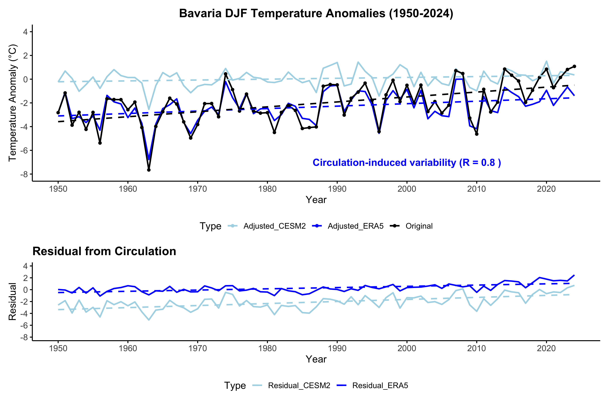

# Cold Extremes {#ce}

*Author: Zhuoyang Li and Katrin Strößner*

*Supervisor: Henri Funk *

```{r setup_coldx, include=FALSE,message=FALSE, warning=FALSE,}
library(bookdown)
library(svglite)

```

## Abstract
Extreme cold events have long been associated with severe societal impacts on energy systems, infrastructure, and public health. Therefore, it remains important to explore the potential for such events to occur in the future and develop appropriate measures in advance. In the context of global warming, even cold winters in Central Europe have been affected by rising temperatures. In this study, we investigated whether extremely cold winters—such as the coldest winter in Germany in 1963—could still occur under a warming climate.

We first applied a dynamical adjustment approach combined with elastic net regression to confirm that atmospheric circulation was the main driver of temperature anomalies. This method also captured a decreasing tendency in the frequency and magnitude of cold extremes under global warming conditions. Furthermore, by examining the most extreme cold storylines from the supplementary boosted data provided by (@sippel2024), we found that extremely cold winters—such as the event observed in 1963—remain physically plausible despite a warming climate.

## Introduction and Geographic Background
Extreme cold events, or cold waves, are periods of unusually low temperatures that can severely impact society, leading to increased mortality, energy crises, and disruptions to infrastructure, transportation, and agriculture (@pinto2024). Europe has experienced several significant cold waves in recent history, including February 2012 in Eastern and Central Europe (@planchon2015), January 2017 in Southeastern Europe (@anagnostopoulou2017), March 2018 across Northern and Western Europe (@karpechko2018), and the winter of 2023, which was exacerbated by energy shortages linked to the Russian-Ukrainian war (@quesada2023). Despite long-term warming trends, cold waves remain a major concern due to their unpredictable nature and severe socio-economic consequences.

Cold waves typically arise from persistent atmospheric circulation patterns that direct the cold Arctic or Eurasian air into Europe (@quesada2023). Key mechanisms include Scandinavian blocking, sudden stratospheric warming events, North Atlantic sea surface temperature anomalies, and snow-albedo feedbacks, which can amplify and prolong cold conditions. One of the most extreme examples is the winter of 1962/1963, the coldest on record in many Central European countries ([@eichler1970; @sippel2024]). This winter was characterized by prolonged high-pressure blocking over Northwestern Europe, which diverted the usual westerly flow and allowed persistent easterly winds to bring frigid air into the continent (@loikith2019). Extensive snow cover reinforced the cold through high albedo effects, leading to the freezing of major European rivers and lakes, including the Rhine, Rhône, IJsselmeer, and large parts of the Baltic Sea (@groisman1994). The resulting extreme conditions had severe impacts on human health, infrastructure, and energy systems, highlighting the risks posed by such events even in a warming climate (@eichler1970).

This study builds on the work of (@sippel2024), who investigated the question: "Could an extremely cold central European winter such as 1963 happen again despite climate change?" Their research addressed two key questions: (1) If a winter atmospheric circulation similar to 1963 were to re-occur in present-day climate, what would be the intensity in terms of cold temperatures? and (2) Is a winter as cold as 1963 or colder still possible in Central Europe today? The present study focuses in greater detail on the second question, assessing the potential for such an extremely cold winter in the current climate and its implications for future extreme events.

## Data processing
In order to investigate potential worst-case cold winter conditions in Germany with a particular focus on Bavaria, we utilized the ERA5 reanalysis dataset (@hersbach2020) to analyze temperature anomalies during the winter months, specifically from December to February (DJF). To detect anomalies, we applied a 90-day moving average to remove the seasonal cycle, using 1981–2010 as the reference period. Seasonal temperature anomalies were calculated from daily anomalies. 

## Methods
### Dynamical Adjustment using Elastic Net Regression
Dynamical adjustment is a technique in climate science, that aims to estimate the influence of atmospheric circulation on a target surface climate variable, such as surface air temperature ([@wallace1995; @smoliak2015;@deser2016]). Here, we first apply dynamical adjustment to explore the influence of circulation patterns on temperature anomalies and to better understand the results obtained from other methods. Formally, the temperature anomaly at time \( t \), denoted \( T(t) \), is expressed as:

$$
T(t) = T_{\text{circ}}(t) + T_{\text{resid}}(t),
$$
where:

1. **Circulation-induced component** (\( T_{\text{circ}}(t) \)) : Represents the part of the temperature anomaly that is driven by large-scale atmospheric circulation patterns.

2. **Residual component** (\( T_{\text{res}}(t) \)) : Captures thermodynamical effects, including externally forced warming and other unknown influences not explained by circulation patterns.

Atmospheric circulation is typically difficult to measure directly, as it is not a single, easily defined quantity. Instead, it influences observable variables such as sea level pressure (SLP) and geopotential height, which are commonly used as proxies for large-scale circulation ([@smoliak2015; @sippel2019]). These variables capture essential aspects of circulation patterns, including the strength and position of high- and low-pressure systems, the configuration of jet streams, and the occurrence of blocking events.
To extract the circulation-induced component, we use sea level pressure (SLP) patterns as a proxy for atmospheric circulation. By applying statistical regression techniques, we estimate the part of temperature variability that these circulation patterns can explain. However, this method assumes a linear separation between circulation and thermodynamical effects. In reality, climate processes can be more complex, making this a limitation of the approach.

In our study, we pursue two different approaches to dynamical adjustment. Both methods aim to estimate the circulation-induced component of daily mean winter temperature over our study region Bavaria,using a regularized linear regression technique, called “elastic net regression” (@zou2005). The first approach is based on the ERA5 reanalysis dataset, where an elastic net regression model is trained using sea level pressure (SLP) grid cells as predictors. 

We also use a second dynamical adjustment approach, in which the regression model is trained on the CESM2-LE, using the same predictors as in the ERA5-based model. We subtract the domain-average mean trend of geopotential height patterns to account for the long-term column expansion due to warming (@sippel2024), which allows for a greater focus on the interannual variability of atmospheric circulation and its impact on temperature. The resulting regression model, trained entirely on CESM2-LE, is independent of the observational data and is subsequently applied to the ERA5 dataset for comparison.


#### Elastic Net Regression
The model estimates the coefficient vector \( \boldsymbol{\beta} \) by minimizing the following penalized least squares objective function:

\[
\hat{\boldsymbol{\beta}} = \arg\min_{\boldsymbol{\beta}} \left\{ \| \mathbf{y} - \mathbf{X} \boldsymbol{\beta} \|_2^2 + \lambda \left[ \alpha \| \boldsymbol{\beta} \|_1 + (1 - \alpha) \| \boldsymbol{\beta} \|_2^2 \right] \right\}
\]

where:

- \( \mathbf{y} \) denotes the vector of surface temperature anomalies,  
- \( \mathbf{X} \) represents the matrix of circulation-related predictors (e.g., gridded SLP values),  
- \( \lambda \geq 0 \) is a tuning parameter controlling the overall penalty strength,  
- \( \alpha \in [0, 1] \) determines the balance between the L1 and L2 penalties.

This formulation combines two regularization methods: Lasso (L1) and Ridge (L2) regression. The L1 penalty results in sparsity by shrinking specific coefficients to zero exactly, which can be interpreted as making variable selection by including only the most important predictors in the model. The L2 penalty shrinks the coefficients more evenly and stabilizes the model if predictors are highly correlated. By adjusting the mixing parameter \( \alpha \), Elastic net blends the advantages of both methods, enabling variable selection while maintaining model stability and predictive accuracy in multicollinearity. These properties make elastic nets particularly suitable for modeling temperature responses to spatially structured and interdependent circulation fields.

### Ensemble Boosting
Cold extremes pose significant challenges in climate science due to their substantial socio-economic impacts. Traditional climate models struggle to capture the rare and intense nature of these events, necessitating advanced methodologies such as ensemble boosting. Hence, (@sippel2024) explored the principles of ensemble boosting and its application to evaluate whether a worst-case cold winter such as 1963 is still possible. They focused on a 30-member CESM2 initial condition large ensemble (CESM2-ETH) from 2005 to 2035 to generate physically plausible worst-case scenarios of extremely cold winters.

Ensemble boosting is a technique designed to enhance the representation of extreme weather and climate events in model simulations. The core concept involves perturbing an initial state within a climate model, allowing different yet physically consistent realizations of an extreme event. By systematically re-initializing the model with minuscule perturbations, it becomes possible to explore the tail behavior of the event distribution.
In the context of climate modeling, boosting follows a two-step approach:

1.	**First-order boosting** – Re-initialization occurs approximately 5-20 days before an identified extreme event using a round-off perturbation. This yields multiple ensemble members, each evolving uniquely but within the constraints of atmospheric dynamics.

2.	**Second-order boosting** – After identifying the coldest simulations from the first-order boosted ensemble, additional perturbations are applied to these extreme cases, further refining the representation of worst-case scenarios.

This approach enables a more comprehensive understanding of potential extreme cold events by expanding the dataset of plausible realizations beyond those found in standard climate model ensembles, such as single model initial-condition large ensemble (SMILEs).

#### Data and Methodology of Ensemble Boosting
In the study of (@sippel2024), the CESM2-ETH large ensemble, spanning 900 winter seasons (December-January-February, DJF) from 2005 to 2035, serves as the foundational dataset. This dataset follows the CMIP6 historical forcing (2005-2014) and the SSP3-7.0 scenario (2015-2035). Each of the 30 ensemble members originates from a transient historical simulation with a round-off perturbation in atmospheric initial conditions. To analyze extreme cold events, a boosting methodology was applied:

-	**First-order boosting**: The coldest December during the 2020s in the CESM2-ETH ensemble was identified. This simulation was then perturbed and re-initialized for each day from December 1-15, generating 50 ensemble members per day. This resulted in a total of 750 simulations, capturing a well-constrained representation of early winter cold conditions.
-	**Second-order boosting**: To further explore extreme cold persistence into January, the two coldest simulations from the first-order boosted set were selected. These were subsequently re-initialized daily from January 1-15, with 50 ensemble members per day, leading to 1500 additional simulations.
```{r boosting-example, echo=FALSE, out.width='70%',fig.align='center', fig.cap= 'This figure (a) provides an illustrative example of model boosting, adapted from (@sippel2024)' }
knitr::include_graphics("work/03-coldex/figures/boosting original.png")

```

The perturbation methodology maintained physical consistency by applying small modifications to the specific humidity field (q) at each grid point, with a magnitude of $10^{-13}$. These perturbations ensured mass, energy, and momentum conservation up to the precision of a round-off error. The coupled model was then run for 60 days, with ensemble spread remaining small for the first 4-5 days before diverging significantly.

Instead of replicating the exact methods used by (@sippel2024), this study focuses on leveraging the provided supplementary boosted data by (@sippel2024) to examine the most extreme cold storylines. Specifically, the study analyzed: 
(i) The three coldest storylines (minimum temperature and average temperature) from the BSSP370cmip6.0480013.zip dataset. 
(ii) The three coldest storylines (minimum temperature and average temperature) from the BSSP370cmip6.0230013.zip dataset.

These datasets consist of (i) first-order boosting simulations originating from ensemble member 13 of CESM2-ETH, initialized on December 6, 2022, and December 15, 2022, as well as second-order boosting simulations branching off from specific first-order boosted members ensemble member 23 on December 6, 2022, and ensemble member 48 on December 15, 2022). By analyzing these datasets, this study aims to answer the research question whether winters such as 1963 are still possible in today’s climate.

## Results and Discussion
Here, the key findings derived from the applied methods are presented, followed by a reflection on their scientific implications and a discussion of the methodological limitations and uncertainties involved in the analysis.

### Dynamical Adjustment

The circulation-induced component of temperature variability is clearly separated from the residual component, which is not explained by circulation and likely reflects thermodynamical effects (Fig.\@ref(fig:dynamical-trend)).  The residual time series shows a consistent upward trend (Fig.\@ref(fig:dynamical-trend) bottom), indicating that thermodynamical warming plays a significant role in addition to circulation changes. Besides, the circulation-induced variability shows a strong Pearson correlation of R = 0.8 with the observed, detrended DJF temperature anomalies over Bavaria (Fig.\@ref(fig:dynamical-trend) top), thus supporting the conclusion that circulation is the main driver of inter-annual winter temperature variability as suggested by the reference study. (@sippel2024) 

```{r dynamical-trend, echo=FALSE, out.width='90%', fig.align='center', fig.cap='Winter temperature anomaly time series over Bavaria and long-term trends, dashed lines show linear trends in the original time series (black) and the circulation-induced and residual component (blue).'}

```

 - **Top:** 1951–2024 winter (DJF) temperature anomalies and the contribution of atmospheric circulation (blue line)
 - **Bottom:** residual temperature anomaly time series when atmospheric circulation contributions are removed and the trend of this “circulation conditional” residual.
 
The dark blue line (adjusted using ERA5) shows a clear upward trend, suggesting a decrease in the frequency of cold spells (Fig.\@ref(fig:dynamical-trend) top). This indicates that, in addition to thermodynamical effects, changes in atmospheric circulation have also contributed to winter warming over Bavaria. However, the CESM2-based light blue line remains relatively flat, showing little to no evidence of strong externally forced changes and suggesting that the future of regional circulation changes under external forcing remains highly uncertain.

This raises a critical uncertainty, as discussed in (@sippel2024): whether the circulation trend observed in recent decades represents an externally forced signal or just natural variability. If the trend is indeed forced but not captured by the models, extreme cold winters like 1963 may become less likely in the future. Conversely, if the observed trend is primarily due to natural variability, it could reverse, and similar cold extremes may occur again. This uncertainty remains a key challenge in climate modeling, and understanding it better is crucial for improving future predictions.

### Ensemble Boosting
The three coldest storylines, in terms of both minimum temperature and average temperature, were analyzed for ensemble members 23 and 48 from the first-order boosted simulations.
```{r boosting-result23, echo=FALSE, out.width='90%', fig.align='center', fig.cap='The three coldest storylines (based on minimum and average temperature) are derived from ensemble member 23. The data are extracted from the file BSSP370cmip6.0230013.zip, provided by (@sippel2024)'}
knitr::include_graphics("work/03-coldex/figures/boosting results23.png")
```
For ensemble member 23, the lowest recorded temperatures in the second-order boosted simulations reached a minimum temperature of -26.3°C, while the average temperature over the winter period from January to March was -12.1°C. Figure \@ref(fig:boosting-result23) illustrates the three coldest minimum temperature storylines in the left panel and the three coldest average temperature storylines in the right panel. The ensemble members associated with these extreme conditions-ens010, ens040, and ens042 for minimum temperature, and ens037, ens039, and ens047 for average temperature—exhibit pronounced cold events, highlighting the capacity of the boosting technique to explore the statistical tail of extreme winter conditions.

```{r boosting-result48, echo=FALSE, out.width='90%', fig.align='center', fig.cap='The three coldest storylines (based on minimum and average temperature) are derived from ensemble member 48. The data are extracted from the file BSSP370cmip6.0480013.zip, provided by (@sippel2024)' }
knitr::include_graphics("work/03-coldex/figures/boosting results48.png")

```
For ensemble member 48, the coldest recorded temperatures in the second-order boosted simulations included a minimum temperature of -25.9°C, which consistently occurred at the start of the initialization, and an average temperature of -10.2°C over the winter period from January to March (Fig.\@ref(fig:boosting-result48)). The fact that the lowest minimum temperatures always appeared at the beginning of the initialization phase suggests potential influences of edge conditions, temporal dependencies, or initialization bias. To address these factors, early January was excluded from the analysis. When focusing on mid-to-late winter, the lowest minimum temperature was observed in simulation ens037, reaching -23.1°C.

The ensemble boosting results demonstrate that extremely cold temperatures, such as in the winter of 1962/1963 or colder, can still be reached today under an SSP3-7.0 scenario. This contrasts with the findings by (@quesada2023), who observed a general decline in the frequency and severity of cold events across Europe. However, the presented results align with other studies suggesting that under certain conditions—such as a weakening Atlantic Meridional Overturning Circulation (AMOC)—cold extreme intensities may increase in the future (@meccia2023). This apparent contradiction illustrates the complex and multifaceted nature of cold event dynamics. It also reflects the low seasonal predictability identified in recent research, which attributes this uncertainty to chaotic atmospheric forcings, such as variability in westerly winds (@kautz2021). The finding that extreme cold events remain possible is further supported by (@brunner2018), who showed that approximately 70% of central European cold extremes coincide with atmospheric blocking between 60°W and 30°E—highlighting the continued relevance of large-scale weather patterns as a dominant driver.

Last, there are important limitations to consider. The distribution and frequency of “boosted” cold events are sensitive to the specific events selected for enhancement, which may influence the representativeness of the results. Additionally, re-initializing the model with different atmospheric conditions could potentially generate even colder outcomes, indicating that the full range of extreme winter possibilities might not be fully captured.


