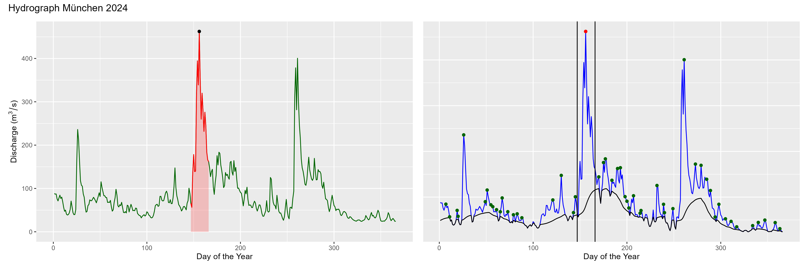
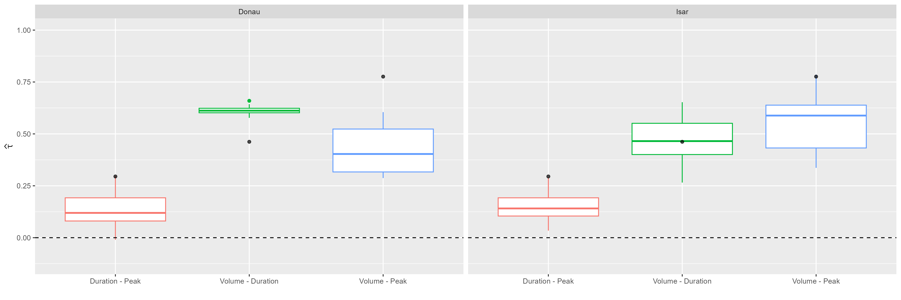
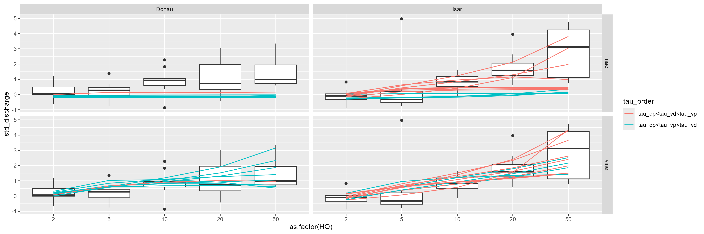
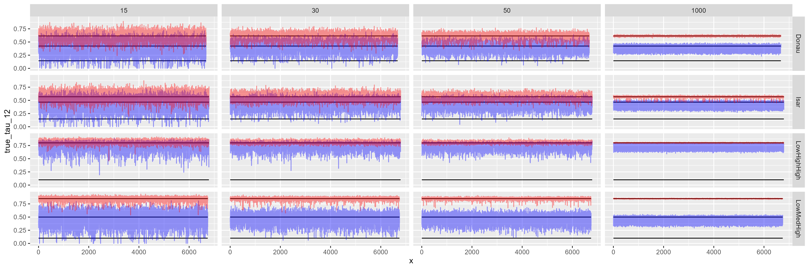
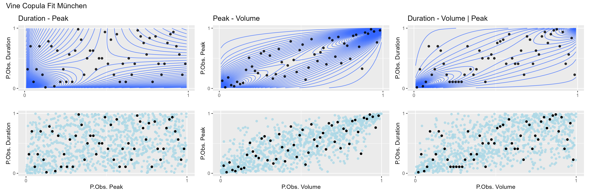
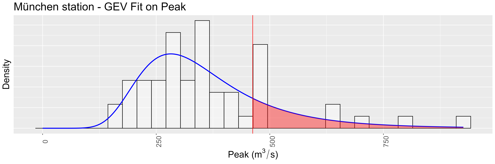
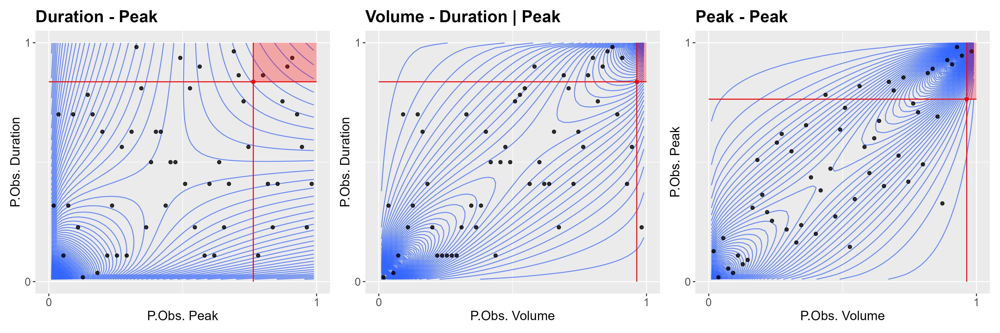
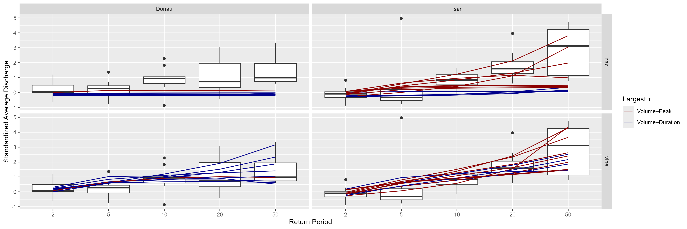

---
output:
  pdf_document: default
  html_document: default
---

(ref:captionScatterText) The Kendall's tau coefficients for the three dependency structures of volume, duration and peak for the Isar and the Danube. Black dots mark the respective results found in Grimaldi (2006).


# Flood Frequency Analysis


*Author: Hannes Grün, Robin Schüttpelz*

*Supervisor: Henri Funk*

*Suggested degree: Master*

## Abstract {.unnumbered}
Floods are among the most impactful natural hazards in Bavaria, 
causing significant economic and ecological damages. 
Traditional univariate flood frequency analyses, 
which estimate return periods based solely on peak discharge, 
often fall short in capturing the complexity of real-world flood events characterized by interdependent 
features such as volume, duration, and peak. 
This chapter investigates multivariate modeling approaches using copula theory to better describe 
the joint behavior of these variables. 
Building on the foundational work of @grimaldi2006, the study evaluates the applicability 
of nested Archimedean copulas and extends the modeling framework to vine copulas 
to accommodate asymmetric dependencies and varying tail behaviors. 
Empirical data from $21$ hydrological stations across the Isar and Danube rivers are analyzed, 
revealing $3$ distinct dependence structures that cannot be adequately captured by symmetric or 
nested copulas alone. This work compares copula model performances
and discusses implications for estimating multivariate return periods. 
The findings underscore the importance of flexible dependence modeling in flood risk 
assessment.

## Introduction {#intro}
Floods rank among the most severe natural hazards in Bavaria, both in terms of ecological and socio-economic impact. 
Structural damages in Bavaria typically occur to private residential buildings, agricultural facilities, 
public infrastructure, and critical transport systems such as roads and bridges. In 2024 alone, flood events 
in Bavaria caused an estimated €4 billion in damages. Environmental impacts, such as contamination 
from leaked heating oil, also pose serious consequences but are often difficult to quantify in 
monetary values (@lfu2025).
These significant damages emphasize the need for robust risk assessment tools 
to support decision-making in floodplain management and infrastructure design. 
Traditional flood frequency analysis in hydrology has largely focused on univariate approaches, 
where the relationship between flood peak and its return period is estimated independently of other 
hydrological variables (@khajehali2025). 
While such analyses are suitable for preliminary risk assessments, 
they have limited capability to represent the complexity of real-world flood events, 
especially when applied to the design of hydraulic structures or the 
planning of flood protection measures (@grimaldi2006).
Flood events are characterized not only by their peak discharge but also by their volume and duration. 
These variables are interdependent, and their joint behavior plays a critical role in determining the severity of flooding impacts. 
For instance, a moderate peak may still result in significant inundation if the flood duration is long or 
if the volume exceeds reservoir capacity. 
To model these dependencies, multivariate statistical techniques have been introduced, 
enabling the analysis of joint cumulative distribution functions and probability density functions across multiple variables (@grimaldi2006).
Copula theory provides a robust statistical framework for conducting multivariate flood analyses. 
By separating the marginal distributions from the dependence structure, the joint behaviour of hydrological variables can be studied more flexibly.\
In particular, asymmetric copula functions—such are highly effective in flood frequency analysis due to their ability to model varying strengths of dependence between pairs of variables. 
This is particularly relevant in hydrology, where empirical evidence suggests that the flood peak can strongly influence the dependence between volume and duration, introducing asymmetry into the joint distribution (@grimaldi2006).
The work of @grimaldi2006 represents a significant contribution in this field. They proposed a trivariate flood event analysis using nested Archimedean copulas to jointly model flood peak, volume, and duration. 
However, this work points out the shortcomings of nested Archimedean copulas and extends the author's approach
by vine copulas. 
The present thesis addresses three main research questions:
(1) How can copula models be applied to characterize flood events in Bavaria, similarly to the approach by @grimaldi2006? 
(2) How do nested Archimedean copulas compare to more flexible structures such as vine copulas in representing interdependencies? 
(3) How does the interpretation of return periods differ when using univariate versus multivariate approaches?
By addressing these questions, this work aims to contribute to a more nuanced understanding of flood risk, ultimately improving predictive accuracy and informing better flood management strategies in Bavaria.

## Data {#data}
@grimaldi2006 used the variables peak, volume and duration
of the most severe flood event within a year. 
These variables are derivable from yearly hydrological discharge data.
The discharge data we use during our analysis 
is provided by the 
Bavarian Environmental Agency's hydrological service (GKD) (@gkd2025) which 
is data from multiple measurement station along the Isar and the Danube. 
Based on this, the following 
gives a brief description of the data,
discusses possible flood event detection methods,
derives the variables of interest based on the flood definition and 
ends with a display of the crucial aspects of the obtained data.

After removing stations with too little observations, 
the data contains discharge values in $15$ minute steps for 
$21$ stations along the Isar and Danube from different starting time points, but always up to 31.12.2024.
Of these stations, $12$ are along the Isar and $9$ along the Danube where every station had at least $44$ years of observation. 
As seen towards the end of this section, the alpine river Isar and the low-lying Danube have contrasting 
hydrological characteristics, enabling a meaningful comparison of flood dynamics in Bavaria.
The exact spatial distribution of the considered station displayed plot \@ref(fig:bavaria). 
```{r bavaria, echo=FALSE, message=FALSE, warning=FALSE, out.width="100%", fig.align='center', dpi = 52, fig.cap="The location of the selected measurement stations for the Isar and the Danube in Bavaria, Germany."}

```
Given the annual discharge data for all these stations, we require to identify the 
most severe flood event within each year which defined as the event with the largest discharge peak. 
To stabilize event detection, the following is based on daily average discharge values we 
calculated based on the $15$ minute time intervals in the original data.\
The flood detection approach proposed by @grimaldi2006 of using the straight-line method based on a fixed threshold 
was found to be highly unreliable, but so  was a quantile-based straight-line method.
Both approaches exhibit significant uncertainties in identifying flood events, 
particularly, they tend to overestimate flood duration.
Instead, we applied
the baseflow methods proposed and implemented by @wasko2025. 
This method relies on the baseflow index (BFI) which is the ratio of the baseflow volume to the volume of streamflow. 
<!-- Calculte BFI at each time step and extracts discrete flood events when the BFI falls below the specified threshold for a user-specified minimum duration. -->
A default BFI threshold of 0.5 was used to distinguish events dominated by rapid runoff contributions typically associated with rainfall- or melt-induced flooding.
Exemplary, figure \@ref(fig:hydro) shows the hydrograph for the station in Munich in 2024. 
```{r hydro, echo=FALSE, message=FALSE, warning=FALSE, out.width="100%", fig.align='center', dpi = 52, fig.cap="An exemplary hydrograph of the Munich station in 2024 (left) with the applied flood detection method result (right)."}

```
Both subplots in the figure display the same hydrograph, but the right describes the identification of the most
severe flood. First, all flood events are selected. Then, the flood with the largest peak identified. The 
flood duration is based on the previously described process.
Finally, the 
variables of interest are determined. That is, 
flood peak is the maximum discharge value occurring within the event,
flood duration is the time span measured in days between the start and end of the event, as determined by the BFI threshold crossings.
Flood volume is the cumulative streamflow over the flood duration, representing total discharge volume in $m^3$.
These are neatly displayed on the left subplot.

Now, we come to the most crucial aspect in our data and show that this structure is also found in @grimaldi2006. That is, fig \@ref(fig:corplot) displays the rank correlation coefficient Kendall's $\tau$ 
of every possible combination between the $3$ variables separated by river.

```{r corplot, echo=FALSE, message=FALSE, warning=FALSE, fig.align='center', out.width = "100%", fig.cap="(ref:captionScatterText)"}

```

The boxplots in figure \@ref(fig:corplot) 
are based on the $9$ and $12$ stations along each river, respectively, and 
depict the $\tau$ values for the corresponding variable combination seen on the $x$-Axis.
The black dots refer to the $\tau$ values observed by @grimaldi2006. 
Most important here is that none of the boxplots align horizontally. That is, the strength of dependence 
differs between all pairs of variables. 
Thereby, our data suggests $3$ different distinct dependencies.
This finding is most crucial and, as we will see later on, renders @grimaldi2006 approach infeasible. Because, as seen from the black dots, not only our data suggest $3$ separate dependence structures, but also the river @grimaldi2006 considered.\
Also interesting is the exact order of correlation values by each river.
<!-- difference between the rivers in what variables have the strongest dependence.  -->
For both rivers, duration and peak always had the lowest correlation value.
For the Danube, 
volume and duration are always the variables with the highest correlation with an exception of only one station.
Nevertheless, all these values are quite similar as seen from the width of the boxplot in figure \@ref(corplot).
For the Isar, on the other hand, we observe not only more variation in the correlation
values, but here the most correlated pair tends to be volume and peak. Of the $12$ stations, $8$ 
had volume and peak to be the pair with the highest correlation.\
This emphazises the aforementioned contrasting 
hydrological characteristics which are highly relevant for copula modelling and, thereby, for our analysis.
<!-- Mention: Isar has similar correlation structure as in paper -->

Finally, the analysis section utilizes return periods of flood peaks to derive 
average discharge values conditioned on a certain peak.
To ensure these are 
comparable among stations, they are normalized by the station specific mean and standard deviation. 
To now characterize a conditional distribution using our data, we ordered all flood events within each station
by their peak values and then selected the quantiles corresponding to the 
return periods $2, 5, 10, 20$ and $50$ years.
Thereby, we obtained $21$ average discharge values for each return period.
Consider figure \@ref(fig:condEmpBoxplots) for a visualization.
```{r condEmpBoxplots, echo=FALSE, message=FALSE, warning=FALSE, fig.align='center', dpi = 300, fig.cap="The standardizes average discharge values by peak quantiles of the GKD data."}

```
First of all, note that the average discharge values are on the 
y-axis ranging from $-1$ to $5$. This is due to the 
standardization process within each station. The x-axis denotes the 
return periods of the peak based on the quantile approach. 
To account for the different structure between rivers, the figure considers them separately. 
Thereby, each boxplot in the Danube column is based on $9$ data points and $12$ for the Isar where each data
point corresponds to a station. 

For both subplots, the average discharge increases with an increase in the return period. 
However, while the subplot of the Danube suggests a moderate increase in average discharge values, 
the Isar has a stark increase. But by the size of the boxplot at return period $50$, this increase does not 
hold for all stations. 

## Methods {#methods}
To address the dependence structures identified in the previous section, 
this chapter 
extends the approach of @grimaldi2006 by incorporating vine copulas. 
This extension is necessary because a simpler approach is insufficient to capture the full correlation pattern
observed in the data. 
The following introduces the foundational theory of copulas, 
the family of Archimedean copulas as well as nested Archimedean and vine copula models. 
In addition, methods for copula fitting and model selection are briefly discussed. 
Then, some applied, but non-essential methods are briefly established. 
Together, these elements form the theoretical framework on which this paper is based.
Finally, a few words to the implementation of these methods and used packages.
	
### Copulas {#cops}

@zhang2019 (p. 62) describe a copula as a cumulative distribution
function (CDF) with standard uniform margins. The dimension $d$ of a copula
denotes the number of random variables it relates and, hence, a copula is at least bivariate ($d \geq 2$).
To give a mathematical definition, consider the vector
$u = (u_1, ..., u_d) \in \mathbb{R}^d$ where $u_j \in [0, 1]$ for
$j = 1, .., d$. Then, a $d$ dimensional copula is defined by
@durante2016 (p. 14) as function $C:[0,1]^d\to [0,1]$ if, and only if,
the following conditions hold:

i)  $C(u_1, ..., u_d) = 0$ if $u_j = 0$ for at least one
    $j \in \{1,…,d\}$.

ii) $C(1, 1, ..., 1, u_j, 1, ..., 1) = u_j$

iii) $C$ is $d$-increasing

<!-- The first two conditions make up the boundary conditions of a $d$ -->
<!-- copula. This notion is due to the fact the conditions use the least and -->
<!-- the greatest element in the domain of the copula, respectively (see -->
<!-- @nelsen2006, p. 9). -->

According to @nelsen2006 (p. 9), condition i. shows that copulas 
are grounded. In this context, grounded means that
plugging in $0$ for just one of the variables yields a copula value of $0$, independent of the 
other variables' value.
The author also mentions that, using condition ii., the margins of the function $C$ with respect to a certain variables are obtained by 
plugging in $1$ for all other variables. 
Finally, the condition of $C$ to be $d$-increasing is cumbersome to map out in
higher dimensions, which is why the following is restricted to the $d = 2$ case.
According to @nelsen2006 (p. 8), the copula function $C$ is
$2$-increasing if for all $u_1, u_2, v_1, v_2 \in [0,1]$ with
$u_1 \leq u_2$ and $v_1 \leq v_2$: 
$$
C(u_2, v_2) - C(u_2, v_1) - C(u_1, v_2) + C(u_1, v_1) \geq 0
(\#eq:twoincreasing)
$$ 
Simply put, 2-increasing means that the volume under the copula density
function over the rectangle $[u_1, u_2] \times [v_1, v_2]$ is
non-negative. This interpretation follows from the fact that copula functions are defined as CDF and holds for higher dimensions, too.\
<!-- Based on condition i. and iii., @nelsen2006 (p. 9) also concludes that to  -->
<!-- the copula function $C$ is nondecreasing in -->
<!-- each argument. \ -->
The next section introduces the central theorem in copula theory and also derives the already mentioned copula density. 

### Sklar's Theorem {#sklarstheorem}
Sklar's Theorem is central to the theory of copulas as it proves
that any multivariate distribution can be constructed using copulas
(@nelsen2006 p. 17, @durante2016 p. 42). Thereby, this theorem allows
to separate the representation of the dependence structure and marginal
distribution functions. The theorem is given by @nelsen2006 (p. 18):\
Let $F_{1,..,d}$ be a $d$-dimensional joint distribution function with
univariate margins $F_1, ..., F_d$. Then, there exists a $d$-dimensional
copula $C$ such that 
$$
F_{1, ..., d}(x_1, ..., x_d)  = C(F_1(x_1), ..., F_d(x_d)) = C(u_1, ..., u_d)
(\#eq:sklar)
$$ 
where $u_i = F_i(x_i)$. Also, $C$ is unique if $F_1, ..., F_d$ are continuous. 
Equation \@ref(eq:sklar) allows $2$ important conclusion: One,
any multivariate CDF may be expressed as a composition of a copula
function $C$ and the univariate margins $F_1, ..., F_d$. Thereby,
@zhang2019 (p. 66) conclude that $C$ connects the multivariate CDF to
its margins which allows to separately consider marginal and 
joint behavior of variables. That is, the problem of determining any
multivariate CDF is reduced to determining the copula. And two, the
marginal distributions do not need to be of the same family because
Sklar's theorem holds regardless.

The aforementioned copula density function is given by (see
@zhang2019, p. 66): 
$$
c(u_1, ..., u_d) = \frac{\partial C(u_1, ..., u_d)}{\partial u_1 ... \partial u_d} = \frac{f(x_1, ..., x_d)}{\Pi_{i = 1}^df_i(x_i)}
(\#eq:copulapdf)
$$ 
where $f(x_1, ..., x_d)$ denotes the joint density of $X_1, ..., X_d$
and $f_i(x_i)$ the marginal density of $X_i$ for 
$i = 1, ..., d$. Based on this equation, the joint density in terms of the copula density is given by 
$$
f(x_1, ..., x_d) = c(u_1, ..., u_d)\Pi_{i = 1}^df_i(x_i)
(\#eq:marginalpdf)
$$

### Symmetric Archimedean copulas and generator functions {#archcops}
As Nelsen (p. 109) states, symmetric Archimedean copulas (SACs) are
widely applied due to their large variety and easy construction. However, SACs only allow the same 
dependence strength and structure among all possible pairs of variables as @zhang2019
(p.124) point out. Therefore, they are not suitable for our analysis as concluded from figure \@ref(fig:corplot) which suggested $3$ distinct correlation values.
However, SACs remain an important building block for more complex copula models. 
Thus, this section introduces the concept of a generator function as it determines the family a SACs belongs to.
Then, we specifically focus on bivariate SACs because following models are based on these.

We first give the general idea of a generator, then the
representation of a copula in terms of the generator and in the end the
copula families we use for our analysis.\
@nelsen2006 (p. 110, 111) defines a generator to be a
continuous and strictly decreasing function
$\phi: [0, 1] \to [0, \infty)$ such that $\phi(1) = 0$. 
If $\phi(0) \to \infty$, the generator is considered to be strict.
The inverse $\phi^{-1}:[0, \infty) \to [0, 1]$  of such generators is 
strictly decreasing on $[0, \phi(0)]$. 
We only apply strict generators as seen towards the end of this section.\
For a generator to yield a valid $d$-dimensional copula,
@grimaldi2006 and @zhang2019 (p. 124) mention that the inverse
requires to be completely monotone which is given if it has
derivatives of all orders with alternating sign 
$$
(-1)^k \frac{d^k \phi^{-1}(t|\theta)}{dt^k} \geq 0.
(\#eq:changingsign)
$$
Now, we are in the position to formulate the general representation of a
$d$-dimensional SAC in terms of its generator. 
The relation is given by
@zhang2019 (p. 123) as
$$
C(u_1, u_2, u_3 \mid \theta) = \phi^{-1} \left( \phi(u_1 \mid \theta) + \phi(u_2 \mid \theta) + \phi(u_3 \mid \theta) \,\middle|\, \theta \right).
(\#eq:generatorSAC)
$$  
Equation \@ref(eq:generatorSAC) shows that
SACs are uniquely defined by their generator
function and a parameter vector $\theta$ which we introduce next.
As mentioned by @nelsen2006 (p. 110, 111, 114), the 
assumed functional form of the generator translates to a specific copula
family. Or, vice versa, assuming a copula family implies assuming a specific generator function. 
The $\theta$ vector, on the other hand, 
influences the dependence strength within the assumed copula family 
as seen in @zhang2019 (p. 86). 
This parameter vector takes on an important role in fitting a copula to observed data. 
That is, for an assumed copula family, this parameter vector remains to be estimated from the data. 
The exact approach is further discussed in section \@ref(est).
For now, note that we focus on the $3$ generator functions with a one-dimensional $\theta$ vector. 
These are specified in table \@ref(tab:generators).\
Finally, equation \@ref(eq:generatorSAC) shows that the arguments
to the SAC are exchangeable (see @nelsen2006 (p. 38)). 
Exchangeability is a form of symmetry and implies that the copula treats
all its arguments the same. 
Thereby, this representation displays the aforementioned restriction of SACs being able to only depict one unique dependence structure. 

| Copula Family | Parameter \( \theta\)           | Generator Function \( \phi(t) \) | Tail Dep.|
|:--------------|:----------------|:------------------|:---------|
| Clayton       | \( \theta \in [-1, \infty)\setminus\{0\} \)       | \( \phi(t|\theta) = \frac{1}{\theta}(t^{-\theta} - 1) \) | Lower |
| Gumbel-Hougaard        | \( \theta \in [1, \infty) \)    | \( \phi(t|\theta) = (-\ln t)^\theta \) | Upper |
| Frank         | \( \theta \in (-\infty, \infty)\setminus\{0\} \)    | \( \phi(t|\theta) = -\ln \left( \frac{e^{-\theta t} - 1}{e^{-\theta} - 1} \right) \) | None |

Table: (\#tab:generators) Generator functions of selected Archimedean copulas according to @zhang2019 (p. 130) and tail dependencies according to @zhang2019 (p. 132).

### Taildependence and Rotation {#taildep}
After explaining what it means for a copula to be of a certain family, 
the following introduces the family specific concept of tail dependence. 
Also, we briefly explain how copulas are manipulated to extend the dependence possible structure one family 
captures.

Tail dependence is differentiated into upper and lower tail dependence. 
Their formulas are given by @czado2019 (p. 34 - 35) as 


$$
\lambda^{\text{upper}} = \lim_{t \to 1^{-}} \mathbb{P}\left( X_2 > F_2^{-1}(t) \,\middle|\, X_1 > F_1^{-1}(t) \right) = \lim_{t \to 1^{-}} \frac{1 - 2t + C(t, t|\theta)}{1 - t}
(\#eq:uppertaildep)
$$
and 
$$
\lambda^{\text{lower}} = \lim_{t \to 0^{+}} \mathbb{P}\left( X_2 \leq F_2^{-1}(t) \,\middle|\, X_1 \leq F_1^{-1}(t) \right) 
= \lim_{t \to 0^{+}} \frac{C(t, t|\theta)}{t}.
(\#eq:lowertaildep)
$$
As seen from both equations, tail dependence is defined as conditional probability that both variables are above 
or below a threshold quantile.
<!-- a probabilistic statement in its limits. -->
Thereby, tail dependence 
measures how likely it is for both random variables to jointly exhibit extreme behavior. 
However, upper tail dependence refers to both variables attaining large values while lower tail dependence means 
both variables are jointly small. 
Note that both, upper and lower tail dependence, depend on the copula function $C$ and parameter $\theta$ and, thus, on the copula 
family. The tail dependencies implied by the copula families we consider are also listed in 
table \@ref(tab:generators) as stated in @zhang2019 (p. 132).\
Finally, tail dependence is a family specific property, however, a copula function may be rotated to 
change its native tail dependence behavior. 
Following @pan2024, this is done by modelling $u_i' = 1 - u_i$ instead of $u_i$ itself. 
Every such transformation concludes in a $90$ degree rotation of the copula function in the corresponding 
direction. This approach is based on the definition of the copula function as multivariate CDF.
Because if instead of $u_i$ the transformation $u_i'$ is modelled, 
the probabilistic statement of the copula in the continuous case changes to 
$C(u_1', u_2|\theta) =  \mathbb{P}(X_1 \geq x_1,X_2 \leq x_2)$ and 
$C(u_1, u_2'|\theta) =  \mathbb{P}(X_1 \leq x_1,X_2 \geq x_2)$
, respectively. 

### Fully Nested Archimedean copulas {#nacs}
Fully nested Archimedean copulas (FNACs) build upon SACs
and partially alleviate their restrictions. 
Note that these are the models @grimaldi2006 made extensive use of.\
As our analysis applies to the trivariate case, FNACs and vines in section \@ref(vines) are introduced
for this trivariate case only.

FNACs are built by nesting bivariate SACs 
$$
C(u_1, u_2, u_3 \mid \theta) = C_1\left( C_2(u_1, u_2 \mid \theta_2), u_3 \mid \theta_1 \right),
(\#eq:defFNAC) 
$$
where $\theta_1$ and $\theta_2$ are the parameters corresponding to copula function $C_1$ and $C_2$ and 
$\theta = (\theta_1, \theta_{2})$ is a vector containing all parameters. 
Note that there are only $2$ distinct parameters $\theta_i$ which is why FNACs, in the trivariate
case, are only able to capture $2$ distinct dependence structures.
This allows $2$ conclusions. First, partial exchangeability remains which means that 
within the bivariate nested copulas $C_2$, the two arguments $u_1, u_2$ are
interchangeable (see @embrecht2003 p. 375). So to a degree, symmetry
prevails.
And second, the nested variables $u_1, u_2$ have the same marginal relation with $u_3$.
That is, $C(a, 1, u_3|\theta) = C(1, a, u_3 | \theta) = C_1(a, u_3|\theta_1)$.
In essence, the statements are equivalent but the important take away is that FNACs are not 
able to display $3$ distinct dependence structures. Thereby, they are not suitable for analysis.
As also @grimaldi2006 observed $3$ distinct correlations, their results are questionable for the same reason.\
Additionally to this restriction, @hofert2016 mention that FNACs 
require the sufficient nesting condition to be fulfilled for equation \@ref(eq:defFNAC) to yield a valid copula.
We limit our considerations to FNACs where all nested copulas are of the same family. 
This corresponds to what @grimaldi2006 used in their analysis. 
Then, the sufficient nesting condition is fulfilled if 
deeper nested variables have a stronger degree of dependence, i.e. $\theta_1 \leq \theta_{2}$.
(see @grimaldi2006). 
<!-- As mentioned by @embrecht2003 (p. 375), the number of distinct -->
<!-- generators or bivariate copulas, respectively, is only $d-1$ while the -->
<!-- number of all possible pairs for $d$ variables is $\frac{d(d-1)}{2}$. -->
<!-- That is, FNACs only model $d-1$ distinct dependence structures.  -->
<!-- This -->
<!-- implies that FNACs do not consider the dependence structure for every -->
<!-- possible pair of the $d$ variables, but between a variable and a joint -->
<!-- distribution (SOURCE FOR THIS? I know I read this somewhere, but it is -->
<!-- also visible from the formula...). In fact, only for $u_1$ and $u_2$ the -->
<!-- direct dependence structure is considered.\ -->
<!-- Thereby, exchangeability is lost, but partial exchangeability remains -->
<!-- because within the bivariate nested copulas, the two arguments are -->
<!-- interchangeable (see @embrecht2003 p. 375). So to a degree, symmetry -->
<!-- prefails.\ -->
<!-- Finally, equation ref:gFNAC simplifies to ref:generatorsSAC for -->
<!-- $\phi_1 = ... = \phi_{d-1}$ and $\theta_1 = ... = \theta_{d-1}$, as -->
<!-- mentioned by @zhang2019 (p. 175). Thus, SACs are a special case of -->
<!-- FNACs. -->

<!-- Since we focus on trivariate copulas, we also formulate the FNAC -->
<!-- representation for $d = 3$ in terms of $C$: $$ -->
<!-- C(u_1, u_2, u_3) = C_1(u_3, C_2(u_1, u_2)) -->
<!-- $$ -->

<!-- -   @grimaldi2004 notes that we have identical margins for $u_3$ and -->
<!--     $u_1$ bzw. $u_2$ with $\phi_1^{[-1]}(\phi_1(u_3) + \phi(u_j))$. As -->
<!--     mentioned above, this is due to the partial exchangeability. -->

Note that equation \@ref(eq:defFNAC) may also be represented in terms of the generator function. Thereby, additional requirements 
regarding the composition of generator functions emerge, as mentioned by @zhang2019 (p. 174). 
However, discussing these requirements is beyond the purpose of this paper. The interested reader is refered to @zhang2019 (p. 174).

<!-- @zhang2019 (p. 174) give -->
<!-- the $d$-dimensional representation in terms of the generator  -->
<!-- $$ -->
<!-- \phi^{[-1]}_1 \left(  \phi_1 \circ \phi_2^{[-1]} \left( \phi_2 \circ ... \circ \phi^{[-1]}_{d-1}\left(\phi_{d-1}(u_1) + \phi_{d-1}(u_2)\right) + \phi_2(u_{d-1})  \right) + \phi_1(u_d) \right)\\ -->
<!-- (#eq:defgFNAC)  -->
<!-- $$ -->
<!-- where $\circ$ represents the composition of functions. -->
<!-- @zhang2019 (p. 174) mentions that due to the nesting of generators, $2$ -->
<!-- additional condition arise. First, $\phi_1^{-1}, ..., \phi^{-1}_{d-1}$ -->
<!-- are required to be completely monotonic and, second, the composition of -->
<!-- functions $\omega_j = \phi_j \circ \phi_{j+1}$ belongs to the function -->
<!-- class $\mathit{L}^*_\infty$ defined as $$ -->
<!-- \mathit{L}^*_\infty = \left\{ \omega:[0, \infty)\to [0, \infty)\ |\ \omega(0) = 0,\ \omega(\infty) = \infty,\ (-1)^{k-1}\frac{d^k\omega(t)}{dt^k} \geq 0; k = 1,...,\infty   \right\} -->
<!-- $$  -->


<!-- Equation ref:eq:gFNAC shows that FNACs allow different generator -->
<!-- functions $\phi_1,  ..., \phi_{d-1}$ where each has its own parameter -->
<!-- $\theta_1, ..., \theta_{d-1}$. In other words, every nested copula $j$ -->
<!-- is able to have its own varying dependence structure via $\phi_j$ and -->
<!-- varying strength of dependence via $\theta_j$ which equation -->
<!-- ref:eq:cFNAC displays.\ -->

### Vine Copulas {#vines}
Vine copulas use the pair-copula construction (PCC) explained by @czado2019 (p. 77 - 80) to characterize 
multivariate dependence structures. 
That is, PCC decomposes multivariate densities into products of (conditional) bivariate densities (see @czado2019 p. 88).  
There exist multiple vine copula classes, depending on the structure the PCC implies, but as we are concerned with the trivariate case, 
these constructions are equivalent. 

We use @czado2019 (p. 78, 90) and define the trivariate copula density as 
$$
c_{123}(u_1, u_2, u_3|\theta) = c_{12}(u_1, u_2|\theta_{12}) \cdot  c_{23}(u_2, u_3|\theta_{23})  \cdot c_{13|2}(u_1|u_2, u_3|u_2\mid \theta_{13|2})
(\#eq:simpvinecopdf)
$$
where $u_i|u_j = F_{i|j}(x_i|x_j)$ denotes the conditional probability.
Note that this copula density is based on the simplifying assumption for vines (@czado2019 p.90, @nagler2018) which means 
that the conditional bivariate density $c_{13|2}$ is independent of exact $x_2$ values. 
It only depends on the conditional probabilities.\
Visible from the number of parameters in the $\theta$-vector, vines are able to capture all $3$ distinct
dependence structures in the trivariate case. 
Also, in contrast to FNACs from section \@ref(nacs) where we followed @grimaldi2006, we do not require the bivariate copulas to be of the same family. Thereby, 
not only the strength of dependence between all $3$ variables may differ, also 
the dependence structure is allowed to change from pair to pair. 


### Estimation and Selection Process {#est}
In practice, we need not only to estimate the parameter vector $\theta$, but also select the best fitting copula.
Thus, the following briefly introduces the pseudo maximum likelihood (ML) approach.
Also, we give a reminder on the Akaike Information Criterion (AIC) as it is our information criterion of choice to select a copula model.

To avoid assumptions on the marginal distributions, 
we estimate the parameter vector $\theta$ using the pseudo-likelihood proposed by @genest1995 
$$
\hat{\theta} = argmax_\theta\ l(\theta) = argmax_\theta\ \sum_{k = 1}^{n}log[c(u_{1k}, u_{2k}, u_{3k}|\theta)],
(\#eq:pseudologlik)
$$
where $u_{ik}$ denotes the marginal empirical distribution function scaled by $\frac{n}{n+1}$.
These transformed variables are refered to as pseudo-observations. 
Depending on the copula model, the definition of the copula density follows either from 
equation \@ref(eq:defFNAC) or \@ref(eq:simpvinecopdf).
Thus, the exact estimation process slightly differs between copula models. \
The AIC is given by @fahrmeir2013 (p. 164) as 
$$
AIC = -2 l(\hat{\theta}) + 2 (|M| + 1)
(\#eq:AIC)
$$
where $l(\hat{\theta})$ represents the log-likelihood of the copula model fit and $|M|$ the number of parameters included in the model. 
We select that copula model with the smallest AIC. 

<!-- ### Empirical Copula {#EmpC} -->

<!-- ADD SOURCES FOR MY STATEMENTS -->

<!-- The probability integral transform (pit) is a transformation that allows -->
<!-- to map any random variable $X$ into standard uniform space $U(0, 1)$. -->

<!-- It is a general theorem not specific to copulas as mentioned in -->
<!-- @durante2016 (p. 6), but it helps to understand Sklar's theorem. -->

<!-- The theorem is given by @hofert (p. 3): Let $F$ be a continuous CDF and -->
<!-- let random variable $X$ have CDF $F$, that is $X \sim F$. Then $F(X)$ is -->
<!-- a standard uniform random variable, that is, $F(X) \sim U(0, 1)$. -->

<!-- TODO: Empirical PIT Empirical PIT is based on the empirical distribution -->
<!-- function\ -->
<!-- introduce pseudo-obs -->

<!-- Thus, pit provides the mechanism to transform the marginals into standard uniform variables, which is required by Sklar's Theorem.  -->

<!-- Pit is more of a prerequisit  -->

<!-- The copula utilizes these transformed variables to describe the dependence structure independent of the original marginals.  -->

### Identifying univariate margins {#gev}
While the the estimation process described in section \@ref(est) utilizes the 
empirical distribution function, an empirical function has undesired properties when re-transforming copula data.
That is, during the estimation process, the empirical distribution functions ensures we 
do not affect the copula model fit by missspecifying the marginal distributions. 
However, after fitting the copula, whenever the inverse of the empirical distribution is applied, it bins any continuous data because it is a step-wise function. This, of course, limits the power of our copula analysis. 
Thus, we decided to fit a Generalized Extreme Values (GEV) distribution to the marginal distribution only for re-transforming any results from the fitted copula models.

The distribution function for the GEV family is given by @coles2001 (p. 47)
$$
G(z) = \exp\left\{ -\left[ 1 + \xi \left( \frac{z - \mu}{\sigma} \right) \right]^{-1/\xi} \right\},
$$
defined for $\left\{ z \middle| 1 + \xi \left(\frac{z - \mu}{\sigma}\right) > 0 \right\}$ where 
$-\infty < \mu < \infty$ denotes the location parameter,
$\sigma > 0$ the scale parameter and 
$-\infty < \xi < \infty$ the shape parameter. 
In practice, these parameters are usually unknown, but @coles2001 (p. 50) describes how these parameters are estimated from data using the ML approach.\
Since GEV distributions are not at essence for our work, we refer the interested reader to @coles2001 (chapter 3)
for a more detailled consideration.

### Kendall's $\tau$ {#kendallstau}
According to @kendall1990 (p. 6), $\tau$ is a measure of association
between two random variables that distinguishes concordant and
discordant pairs. Concordance means that the two variables move in the same
direction while discordance means moving in opposite directions.\
@zhang2019 (p. 86) and @nelsen2006 (p. 159,
161 - 164) show that Kendall's $\tau$ is directly connected to the generator function and, thus,
a function in the parameter $\theta$.
$$
\tau(t)= 4 \int_0^1 \frac{\phi(t|\theta)}{\phi'(t|\theta)}dt + 1
(\#eq:cKendall)
$$ 
where $\phi'(t|\theta)$ denotes the derivative of the generator function. Note that this relation is positive
which is seen in @zhang2019 (p. 134). That is, if the parameter of copula increases, the strength of dependence
increases. Vice versa, if correlation increases, $\theta$ increases, too. Also, note that this implies that 
estimating a $\theta$ implicitly estimates a $\tau$ value.
This is a relation we will use during our simulation.
<!-- As we can see from equation @ref(eq:cKendall), Kendall's $\tau$ - a -->
<!-- measure of association - can be expressed in terms of the copula -->
<!-- function only. It emphasizes once more that the copula captures the -->
<!-- whole dependence structure between variables independent of any marginal -->
<!-- distribution functions. An alternative representation of $\tau$ is in -->
<!-- terms of the generator. We will mostly use this relation to estimate -->
<!-- Kendall's $\tau$ under (wrongfully) assumed symmetry. -->

Empirically, there are multiple versions of Kendall's $\tau$ depending
on the data structure. Since this paper focuses on continuous variables
only, the formula given by @kendall1990 (p. 5) is applicable
$$
t = \frac{P-Q}{\frac{1}{2}n(n-1)}.
(\#eq:eKendall)
$$
$P$ denotes the number of concordant and $Q$ the number of
discordant pairs in the data.

### Software {#software}
The whole analysis is implemented using the programming language R. 
We used the `hydroEvents` package by @wasko2025 
`eventBaseflow`. This method relies on the BFI as explained in the data section using a deftault BFI of $0.5$. , 
Additionally, `eventBaseflow` function calculates the BFI at each time step and extracts discrete flood events when the BFI falls below the specified threshold for a user-specified minimum duration.
For copulas, we relied on the `copula` package by 
@hofert2025 and the `pobs` function to apply the empirical distribution function as described in section \@ref(est). 
FNACs are dealt with using the 
`HAC` by @okhrin2014, especially the 
function.
`estimate.copula` for FNAC fitting which implements the ML approach from section \@ref(est). This required 
some additional code to select the best fitting copula according to the AIC.
For vine copulas, 
`VineCopula` package by @nagler2024 was consulted. 
Especially the function
`RVineCopSelect` which implicitly fits a selection of copulas and also selects the one with the smallest AIC.
Finally, GEV distribution were fitted using the function
`fevd` from the 
`extRemes` package by @gilleland2016 which uses MLE to determine the parameters mentioned in \@ref(gev).

## Simulation {#sim}
<!-- Bias well visible for low high high where the bottom line is not reach at all, -->
<!-- howeer, this goes for all considered correlation structures.  -->
<!-- That is, also for the river correlations suggesting that using  -->
<!-- FNACs on our real world data leadst to the this observed bias  -->
To examine the incapability of FNACs to capture $3$ distinct dependence structures in a trivariate
setting, we ran a simulation. 
The true underlying model builds a vine copula models.
This section is limited to the most crucial finding 
which is highly relevant for the interpretation of our results in the following section.

We set up the simulation by drawing $27000$ random samples of size $15, 30, 50, 1000$. 
The sample size of $50$ represents our real world conditions while $1000$ observations aim to examine large sample behavior. The two smaller samples sizes are interesting because we earlier decided to remove stations due to their small
sample size.\
For each drawn sample, 
the underlying vine copula model has $2$ wheels to tweak:
First, each copula density 
of the underlying vine copula model is allowed to be of one of the copula families 
listed in table \@ref(tab:generators) leading to a possible total of $3^3 = 27$ copula family combinations. 
Second, we allowed for $4$ different correlation values, $2$ of which correspond to the observed average 
correlation values in the Isar and the Danube. The remaining $2$ aimed to examine general behavior of FNACs. That is, we added a Low-Medium-High correlation structure with correlation values of $0.1, 0.5, 0.85$ and a 
Low-High-High structure using $0.1, 0.8, 0.8$.\
Thereby, we had $27000$ data points per sample size which are split among all $27$ possible copula family combinations
and $4$ possible correlation structures. This leads to roughly $\frac{27000}{4\cdot 27} = 250$ data points per setup.
It is not exactly $250$ because we used a uniform draw to select copula families and correlation 
structure as it drastically simplified implementation. 

The one result we want to focus on is described in figure \@ref(fig:simresults).
```{r simresults, echo=FALSE, message=FALSE, warning=FALSE, out.width="100%", fig.align='center', dpi = 52, fig.cap="The simulation results by sample size and correlation structure."}

```
This figure uses multiple subplots displaying trace plots of the $\tau$ values estimated by the FNAC model. 
Kendall's $\tau$ estimates are displayed on the y-axis while the index 
of the iteration in which this model was fitted is on x-axis. Note that this plot does not differ by 
copula family combination leading to roughly $\frac{27000}{4} = 6750$ iterations each.
The black lines in each subplot refers to the true underlying correlation values.
The name of the corresponding 
correlation structure is to the right hand side of the plot.
Additionally, the figure is divided by the sample size on which the estimated FNAC model is based. From a 
sample size of $15$ on the left up to a size of $1000$ on the right. 
Color-wise, the red line refers to the $\tau$ of the nested FNAC and the blue line to the outer estimate.
Due to the sufficient nesting condition (see section \@ref(nacs)), the inner $\tau$ in each iteration  
is always larger than the outer.\
The first observation is the decrease in variance of the estimators as the sample size increases. This holds for 
all possible correlation structures and was expected. 
Now, focus only on the column of sample size $1000$. Especially in the Low-Medium-High subplot, 
we observe that the inner $\tau$ estimate moves around the most upper black line. 
Thereby, the nested copula in a FNAC correctly captures the largest correlation value.
The blue line, however, moves around the second largest black line and its volatility remains comparably large.
We conclude that, first, the $\tau$ estimate of the outer copula of a FNAC model varies within a set interval
for large sample sizes. This is similar to what @grimaldi2006 found in their work when they examined 
how SACs perform if the true underlying model is a FNAC.
Second, and highly relevant for our analysis, 
the $\tau$ based on the outer copula of a FNAC 
tends towards the second largest correlation value in the (simulated) data.
This implies that, due to the same copula margins mentioned in section \@ref(nacs), FNACs systematically
overestimate the weakest dependence strength.
This is an important result because it explains not only the comparably bad performance of FNACs during our 
application, but also their bias in the results.


## Application {#app}
Due to our finding during the simulation, we focus on presenting the fitted vine copulas models.
Only for the the model comparison, we jointly consider FNACs and vines to discuss the 
effect of the bias in FNACs and its practical meaning. 

### Goodness of Fit
The following discusses the goodness of fit for the vine copula model 
based on the Munich station using figure \@ref(fig:visualGoF).
```{r visualGoF, echo=FALSE, message=FALSE, warning=FALSE, out.width="100%", fig.align='center', dpi = 52, fig.cap="The contour lines and synthetic data plots for the Munich station."}

```
This figure consists of $6$ subplots. 
Each column of subplots refers to a pair of variables specified in the column header.
The variable named first is displayed on the y-axis. 
Note that all subplots are on copula level. Thus, all axes range from $0$ to $1$.
The top row of subplots shows the contour lines for the fitted copula density and the bottom row a synthetic
random sample from the copula model. 
The black points in every subplot depict the pseudo observations of the corresponding variables.\
Starting with bottom row, a good model fit implies that the light blue points capture the structure
of the pseudo observations. 
This seems to be the case for all variable pairs as not only the shape of the black points is nicely
reflected in the synthetic data points, but also the strength of dependence matches.
This is validated when comparing the empirical correlation values with the correlation implied 
by the fitted models as seen in table \@ref(tab:corrvalues).
The largest absolute difference between the correlation values is just $0.02$.

| Pair                | Copula Family           | Empirical \( \tau \) | Fitted \( \tau \) | \( |\Delta \tau| \) |
|:--------------------|:------------------------|----------------------:|------------------:|--------------------:|
| Duration – Peak     | Clayton                 | 0.15                  | 0.16              | 0.01                |
| Peak – Volume       | Gumbel-Hougaard         | 0.49                  | 0.51              | 0.02                |
| Duration – Volume   | 180° Rotated Gumbel-Hougaard     | 0.60                  | 0.59              | 0.01                |

Table: (\#tab:corrvalues) Describtives on the fitted copula model for Munich station.

Now, consider the top row of figure \@ref(fig:visualGoF) in combination with the corresponding copula families
mentioned in table \@ref(tab:corrvalues). The Clayton and 180° rotated Gumbel-Hougaard copula imply 
lower tail dependence for the relation between duration and peak as well as duration and volume, respectively. 
Thereby, if the flood peak is small, the duration tends to be short, too. Also, the volume of a flood 
is more likely to be small
given a short flood duration.
However, due to its small strength of dependence, the tail dependence for duration and peak is rather small.
This is not only suggested by the contour lines, 
but follows from the low $\tau$ value which implies that paramter $\theta$ is small, too, as mentioned in 
section \@ref(kendallstau).
This in turn affects the tail dependence as it is a function in $\theta$, as discussed in section \@ref(taildep).
Finally, a Gumbel copula is fitted to the peak and volume pair implying upper tail
dependence. Thus, given a large peak, the flood volume tends to be large, too. 

### Fitted Tail Dependencies
Because tail dependence is an important concept from a hydrological point of view, 
we extend the tail dependence analysis from the previous section to all considered stations.

Contemplate figure \@ref(fig:bavariaTaildep) for a visual assessment of the tail dependence structure.
```{r bavariaTaildep, echo=FALSE, message=FALSE, warning=FALSE, out.width="100%", fig.align='center', dpi = 52, fig.cap="The signed tail dependencies of the three variable combinations."}
knitr::include_graphics("work/04-floodfreq/figures/app_bavaria_taildep.png")
```
This plot shows $3$ different subplots, one for each variable pair. 
The subplots are based on figure \@ref(fig:bavaria) and display all stations colored by their 
tail dependence value. 
Because we only allowed for copula families with either upper, lower or no tail dependence, 
we visualize the signed tail dependence. 
That is, upper tail dependence values remain unchanged, but lower tail dependencies are multiplies by 
$-1$. Thereby, the blacker a station is colored in, the stronger the lower tail dependence and the more 
purple the stronger the upper tail dependence. A totally white point on the map refers to no tail dependence.
In these cases, a Frank copula has been fitted to the variable pair.\
In general, we observe lighter colors for the duration and peak pairs which is due to the rather 
small correlation values. This follows from the reasoning in the previous section.
Duration and volume exhibit the darkest colors suggesting that if the flood duration is short, the 
flood volume tends to be small, too, for the majority of the considered stations. 
This is especially the case at the Isar stations. But, the relationship begins to shift towards a positive dependence approximately at the middle of the river, likely due to the influence of tributaries that contribute additional water as the river progresses downstream.
In contrast, the Danube displays mixed signals for the duration-volume pair, indicating a more complex or variable relationship, possibly reflecting the diverse hydrological influences across its larger catchment area.\
For the peak-volume pair, both rivers show a positive tail dependence, indicating that higher peak flows are generally associated with larger flood volumes. This is consistent with expected hydrological patterns where significant peak events often appear with substantial volumes of water. The duration-peak pair exhibits the weakest tail dependence, suggesting that the flood duration does not strongly influence the peak discharge. This weak correlation is indicative of the more dynamic nature of peak discharges, which may be influenced by short-term, localized weather events rather than the overall duration of the flood.\
Across all three pairs, the Isar consistently demonstrates more extreme tail dependence trends compared to the Danube. This difference is likely due to the more extreme flood characteristics in the Isar, which are influenced by factors such as snowmelt, topography, and high spring rainfall events (@parajkaa2019). 

### Event Probability
The following examines the difference between a univariate and the multivariate approach 
for flood characterization and thereby addresses one of our research questions. 
<!-- We now examine how flood event probabilities differ between a univariate and multivariate approach.  -->
To answer it, the
following focuses on the flood event in Munich 2024 
which had a peak of $462m^3/s$, took $20$ days and had a volume of $406m^3$. 

Figure \@ref(fig:probUni) displays the marginal fit of a GEV distribution to the peak data for the Munich station. 
```{r probUni, echo=FALSE, message=FALSE, warning=FALSE, out.width="100%", fig.align='center', dpi = 52, fig.cap="The GEV fit for the Munich station. The red area delineates floods with a peak equal or higher to the flood event of 2024."}

```
The x-axis of this plot denotes the peak values, the y-axis the density of the fitted GEV model. 
The histogram displays the original data to which the GEV distribution was fitted. The resulting smooth distribution 
is marked by the blue line. The red vertical line marks the peak value of $462m^3/s$ and 
the the shaded area visualizes the probability 
to observe a peak at least as large. Based on the GEV fit, the probability is calculated to be 
$19\%$. Thereby, this approach assigns the a 
return period of such a peak to be $\frac{1}{0.19} \approx5$ years. 
Thus, Characterizing the whole flood event only by its peak,
the return period of the whole flood in Munich of 2024 according to the univariate model is $5$ years.

The trivariate copula model allows to also consider volume and duration values to characterize a flood event.
Figure \@ref(fig:probMulti) is based on figure \@ref(fig:visualGoF) and visualizes 
how the multivariate model determines the probability for a flood event to be at least as severe. 
Also, this plot helps to understand the quite stark differences in the probabilities.
```{r probMulti, echo=FALSE, message=FALSE, warning=FALSE, out.width="100%", fig.align='center', dpi = 52, fig.cap="The copula fit for the Munich station. The red area delineates floods with a peak, volume and duration equal or higher to the flood event of 2024."}

```
Note that, as before, this figure displays the data in terms of their pseudo observations.
The red dot in each subplot marks the event in 2024 and the red lines correspond to the univariate 
univariate observed pseudo values. 
Thereby, a flood event is at least as severe as the flood in Munich if it lies wihtin the shaded area. 
Thus, the probability is obtained by integrating the joint copula density over the cube made 
up by the shaded area. 
According to our model, this adds up to be $2.7\%$ which corresponds to a return period of merely $\frac{1}{0.027} \approx 37$ years. 
Thereby, the return period for such an extreme flood is $\frac{37}{5}\approx7$ times longer
if the flood is characterized not only but its peak, but also by its volume and duration value.
The reason for this drastic difference is 
seen in figure \@ref(fig:probMulti). While the pseudo observation 
of the peak value of the event is around $0.76$,
the volume is at $0.96$. That is, the volume during this flood was exceptionally large which 
decreases the 
probability of such an event to occure. 
Visually, this is seen from the shaded area being very slim. 
In contrast, the univariate consideration of 
peak values only 
is not capable to account for this. 

### Model Comparison 
Finally, this section examines the effect of different peak values onto the other characteristics of a flood. 
Mainly, we are interested in the average discharge value during a flood event as it is a measure 
of the average energy the system has to deal with. 

First, we fit 
station specific GEV distributions onto the observed peak values and determine peaks 
for the return periods of $2, 5, 10, 20$ and $50$ years. 
We choose the upper bound of $50$ years to validate the model predictions using the available data.
Conditional on these peaks, the most likely combination of duration and volume are determined as well as 
the average discharge values calculated and standardized.
Figure  \@ref(fig:modelEval) is based on figure \@ref(fig:condEmpBoxplots) and displays our results.
```{r modelEval, echo=FALSE, message=FALSE, warning=FALSE, out.width="100%", fig.align='center', dpi = 52, fig.cap="The model comparison by river between FNACs and vines."}

```
The rows of the figure refer to the model structure applied to predict the average discharges. 
Additionally, we colored each model prediction by which variable pair had the highest correlation.
First, consider the vine model fits in the bottom row.  The models 
correctly capture the trend suggested by the boxplots independent of which pair of variables has the highest 
correlation. For a return period of $50$, model predictions and boxplots increase in variance. 
This is reasonable because the manner in which an event is extreme depends on the station. Thereby, a joint 
behavior in boxplot and model prediction suggests a good fit. 
For FNACs, consider their performance within the stations of the Isar first. There is a visible 
difference in model performance depending on which variable pair has a larger correlation value. 
If volume 
and peak 
have a larger correlation value, 
the model captures the underlying data structure more reliable than for 
volume and duration being stronger correlated pair.
For the Danube, FNAC models barely move at all failing to capture any trend in the data whatsoever.
To quantify the visual analysis, consider the mean absolute difference of the model prediction to the median
of the data: For FNACs, the error for the Danube is 
$0.70$
and the error for the Isar 
$0.90$
.
Vine outperformed FNACs with an error of 
$0.35$
for the Danube and 
$0.53$
for the Isar.
However, 
take these with a grain of salt because especially for a return period of $50$ years, 
we deal with an extreme event. 
And it is reasonable to expect extreme events to be highly station specific.
Thereby, a model perfectly predicting the median of the average discharge data is desirable. 
\
The reason for the underperformance of FNACs is their incapability of capturing $3$ unique dependence structures 
which leads to $2$ distinct effects.
First and mainly, due to the shared bivariate marginal copula, the performance of FNAC models is 
highly impacted by which variable pair is higher correlated. Because by the sufficient nesting condition,
the stronger correlated variable pair is required to build the nested copula. 
If duration - volume is the higher correlated pair and, thus, peak in the outer copula,
the dependence between duration - peak and volume - peak is forced to be identical. Thereby, conditioning on 
a peak value has the identical effect on both nested variables.
However, if peak is inside the nested copula, duration - peak and volume - peak remain a distinct 
relation structure to peak. Thereby, both models are wrong, but one of them remains more flexible. 
The second effect is independent of the nesting structure. As result of the simulation we observed a systematic
overestimation of the lower correlation value. Because in our data, the smallest correlation
value is always between duration - peak, this strength of dependence is systematically overestimated. 
This implies that an increase in peak affect duration more than it should. And because 
all observed correlation values between the two variable are positive, the duration of a flood 
for given an increasing peak is always overestimated. This implies that the average discharge predicted by
FNACs is systematically too low because the volume is divided by a duration that is too long. In conlusion,
even if some of the FNAC models look as if they captured the underlying structure, they really did not. 
Thereby, this application 
nicely depicts the shortcomings of FNACs and the reason why they are
not suitable if their assumptions are violated.

## Conclusion {#conclusion}
The aim of this work was to investigate the potential of copula-based multivariate models for flood risk assessment in Bavaria, focusing on the joint behaviour of flood peak, volume and duration. 
Three main research questions were addressed: the applicability of copula models to Bavarian flood data, the comparative performance of NACs and vine copulas, and the impact of using multivariate rather than univariate approaches to estimate return periods. 
Our results confirm that copula theory provides a robust framework for modelling the dependence structure between multiple hydrological variables. By applying both vine and FNACs to $21$ stations, we demonstrated that multivariate models are capable of capturing complex, asymmetric dependencies that are not accounted for in traditional univariate analyses.
A key finding is the spatial variability in tail dependence structures across the study area. The Isar, in particular, exhibited more pronounced and often more extreme dependencies—especially between volume and duration, suggesting stronger hydrological controls related to topography, snowmelt, and spring precipitation patterns. 
In contrast, the Danube showed more mixed signals, underscoring the necessity for flexible dependence structures that can adapt to regional hydrological conditions.
When comparing the model structures, vine copulas consistently outperformed FNACs which suffered from structural biases. This limitation was particularly evident when analysing conditional average discharge values, where FNACs systematically underestimated flood severity.
Finally, the comparison of univariate and multivariate return period estimations underscores the need of a multivariate perspective. 
For the 2024 Munich flood event, the return period increased from $5$ to $37$ years when considering the joint severity of peak, volume, and duration. This highlights the risk of underestimating extreme events when relying solely on univariate peak discharge values.
In conclusion, the integration of flexible multivariate copula models, especially vine copulas, represents a significant advancement in flood risk analysis. Their ability to capture spatial and structural dependencies can greatly improve the reliability of flood risk assessments and help create more resilient flood management strategies in Bavaria.