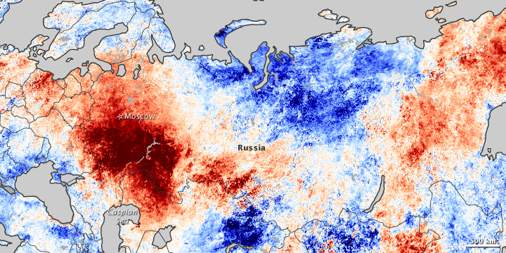
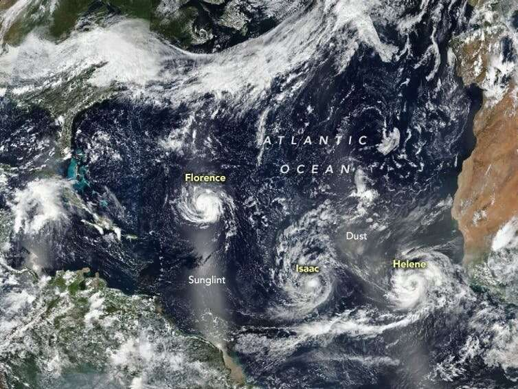
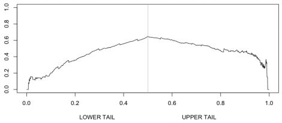
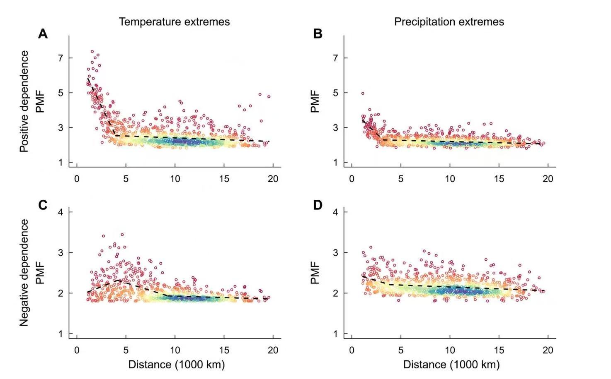
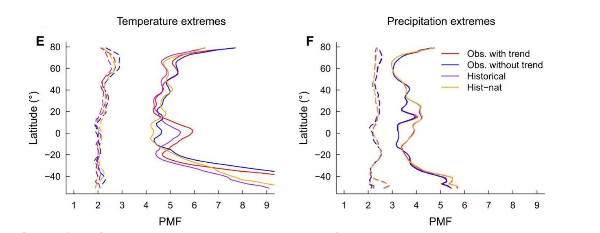
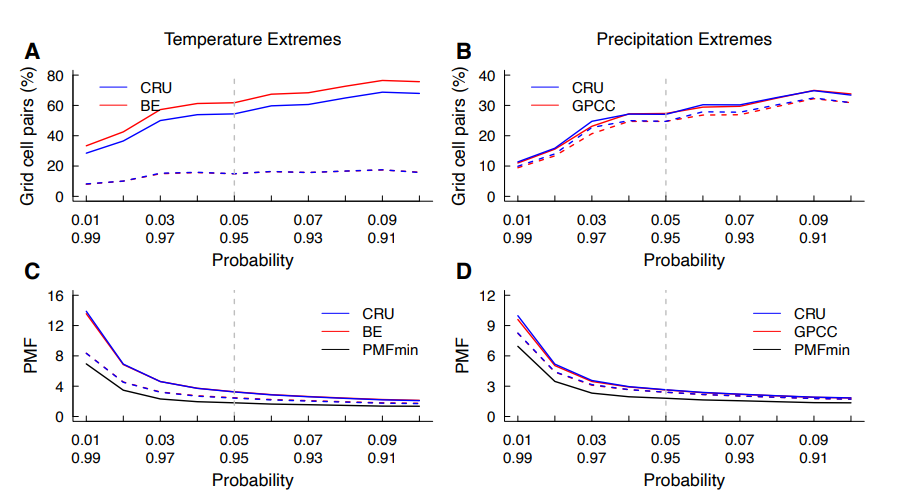

# Co-occurence of extremes

```{r, echo=FALSE, include=FALSE, message=FALSE, warning=FALSE}
library(knitr)
library(ggplot2)
```

*Author: Chongjun *

*Supervisor: Henri Funk*

## Abstract
This report investigates the spatial dependence of extreme co-occurrence globally by employing hypothesis testing. The analysis aims to assess whether extreme events, such as temperature and precipitation extremes, exhibit spatial dependencies across the Earth's land surface. Using observational data from the Climatic Research Unit (CRU), the Berkeley Earth (BE) dataset, and the Global Precipitation Climatology Centre (GPCC), we explore both positive and negative spatial dependencies between extreme temperature and precipitation events. The study quantifies the intensity of spatial dependence by introducing the Probability Multiplication Factor (PMF), which provides a numerical representation of the strength of the spatial correlation between extreme events. Furthermore, we examine how spatial dependence varies with distance and latitude, offering insights into the geographic and climatological factors that influence the co-occurrence of extreme events. The findings demonstrate significant patterns of both positive and negative spatial dependencies, highlighting the complex relationships between extreme weather events and their spatial distribution across different regions.

## Introduction
Climate extremes, such as heatwaves, heavy precipitation events, droughts, and tropical cyclones, pose severe threats to both natural and human systems. Their intensification in recent decades has led to escalating economic losses, ecosystem disruptions, and public health crises. These extremes are not random or isolated occurrences but exhibit distinct statistical dependencies. While extreme events can cluster over time (temporal dependence), they are also spatially dependent, meaning that extreme conditions in one region are often correlated with those in neighboring or even distant areas due to large-scale climate dynamics. Understanding this spatial dependence is crucial for improving risk assessments, predicting multi-region impacts, and formulating climate adaptation strategies.

Although temporal dependence plays a role in the persistence of climate extremes, this report focuses exclusively on their spatial dependence—the extent to which extreme climate conditions co-occur across different locations. Spatial dependence arises due to shared meteorological drivers, such as atmospheric circulation patterns, teleconnections, and geographic influences. For instance, heatwaves are often linked across multiple regions by high-pressure blocking systems, while extreme precipitation events can span large areas due to stalled weather fronts. Recognizing and quantifying these spatial relationships is critical for accurately modeling extreme event risks and preparing for simultaneous disasters that affect multiple regions.

One striking example of spatial dependence in climate extremes is the 2010 Eastern Russian heatwave, which was not confined to Eastern Russia alone but also influenced temperatures across Eastern Europe and Central Asia. The event was driven by a persistent atmospheric blocking pattern, which sustained extreme temperatures over an extensive spatial scale.

\vspace{1em}
```{r, echo=FALSE, out.width='80%', fig.align='center', fig.cap="Source: [https://earthobservatory.nasa.gov/images/45069/heatwave-in-russia]. Heat waves in Eastern Russia, Eastern Europe and Central Asia in 2010.", fig.pos='H'}

```
\vspace{1em}

Another example is tropical cyclones in the Atlantic, where clusters of hurricanes can develop due to favorable oceanic and atmospheric conditions, causing sequential or simultaneous destruction across multiple coastal regions. Similarly, compound flooding events, where storm surges coincide with extreme rainfall across interconnected watersheds, demonstrate the importance of spatially correlated extremes in shaping disaster impacts.

\vspace{1em}
```{r, echo=FALSE, out.width='80%', out.height='200px', fig.align='center', fig.cap="Source: [https://phys.org/news/2019-03-big-storm-clusters-hurricane-hotspots.html]. Hurricanes occur simultaneous in the Atlantic in 2019.", fig.pos='H'}

```
\vspace{1em}

The study of spatial dependence in climate extremes has gained increasing attention as traditional models often assume independent occurrences, leading to the underestimation of multi-region risks. Modern statistical approaches, such as extreme value theory (EVT), copula models, and geostatistical methods, provide powerful tools for quantifying spatial dependence and improving predictions of concurrent extreme events. Additionally, the role of climate teleconnections, such as the El Niño-Southern Oscillation (ENSO) and the North Atlantic Oscillation (NAO), further highlights how distant regions can experience correlated extremes.

Despite advancements in understanding spatial dependencies, significant challenges remain. Non-stationarity in climate extremes—driven by global warming, land-use changes, and shifting atmospheric patterns—complicates the identification of stable spatial dependence structures. Furthermore, as climate extremes become more frequent and intense, their spatial footprints may expand, necessitating continuous refinement of statistical models. Addressing these challenges is crucial for enhancing resilience against climate risks and improving predictive capabilities in disaster-prone regions.

This report will discuss methodologies for quantifying the spatial dependence of climate extremes and examine key characteristics of this dependence on a global scale. By deepening our understanding of how extreme climate events co-occur across space, we can better identify large-scale patterns, improve predictive models, and refine risk assessments to support climate adaptation strategies.

## Tail Dependence
Tail dependence refers to the relationship between the extreme values of two or more variables, specifically whether extreme values of one variable tend to coincide with extreme values of another variable. Unlike traditional correlation \( r(G_i, G_j) \), which measures the linear relationship between variables, tail dependence focuses on the co-occurrence of extreme events, such as the occurrence of severe climate conditions in different regions simultaneously. The objective of this research is not to analyze correlation between regions but to explore how extreme values in one region might depend on extreme values in another region, even if there is no linear correlation.

Statistically, tail dependence is a measure used to quantify the likelihood of simultaneous extreme values in the tails of distributions. There are various methods to measure tail dependence, with the most commonly used being the upper and lower tail dependence coefficients. These coefficients describe the probability of one variable exceeding a threshold given that the other variable has already exceeded a similar threshold, capturing the essence of tail events and their joint occurrences. Tail dependence is crucial in risk management, particularly in fields such as finance and climate science, where extreme events (e.g., market crashes or heatwaves) can have substantial consequences.

\vspace{1em}
```{r, echo=FALSE, out.width='80%', fig.align='center', fig.cap="Source: [https://freakonometrics.hypotheses.org/2435]. Tail dependence of 2 variables.", fig.pos='H'}

```
\vspace{1em}

It is important to note that while correlation can provide insights into the likelihood of tail dependence, a high correlation between two grid cells (\( G_i \) and \( G_j \)) suggests a higher probability of their extreme values occurring together. However, a high correlation does not necessarily imply that extreme values will co-occur, nor does the absence of correlation rule out the possibility of tail dependence. In other words, tail dependence can manifest even when two variables are not correlated, and vice versa.

## Hypothesis Test
We conducted a hypothesis test to assess the spatial dependence of climate extremes. The null hypothesis, \( H_0 \), is that climate extremes occur independently at two grid cells, \( G_i \) and \( G_j \), where \( i \neq j \), at a significance level of \( \alpha = 0.05 \). We aim to identify spatial dependence by rejecting \( H_0 \). The identification of extremes in a grid cell is defined by whether the value exceeds the 95th percentile or falls below the 5th percentile of the distribution. Therefore, the probability that a single grid cell, \( G_i \), is extreme is \( P(G_i \text{ is extreme}) = 0.1 \) (10%).

Next, we consider the joint probability of two grid cells, \( G_i \) and \( G_j \), being extreme. Specifically, the probability that both \( G_i \) and \( G_j \) are extreme is calculated based on two cases: both cells exceeding the 95th percentile, or both cells falling below the 5th percentile. This defines positive concurrence of extremes. For negative concurrence, we consider the case where \( G_i \) is greater than the 95th percentile and \( G_j \) is less than the 5th percentile, or vice versa. In mathematical terms:

- Positive concurrence: 
  $$
  P(G_i > 0.95 \text{ and } G_j > 0.95) \text{ or } P(G_i < 0.05 \text{ and } G_j < 0.05)
  $$

- Negative concurrence: 
  $$
  P(G_i > 0.95 \text{ and } G_j < 0.05) \text{ or } P(G_i < 0.05 \text{ and } G_j > 0.95)
  $$

Under the assumption of no spatial dependence, the probability of either positive or negative concurrence, \( p_0 \), is computed as:

$$
p_0 = 2 \times 0.0025 = 0.005
$$

This is the probability of concurrent extremes occurring at both grid cells, regardless of whether the concurrence is positive or negative, under the null hypothesis of no spatial dependence.

Next, we consider a time frame of 120 years, or 1440 months. The expected number of months during which both grid cells experience concurrent extremes is \( E(X) = n \times p_0 = 1440 \times 0.005 = 7.2 \) months. To test for spatial dependence, we model the number of concurrent extreme months using a binomial distribution:

$$
X \sim \text{Binomial}(n = 1440, p = 0.005)
$$
\vspace{1em}
```{r, warning=FALSE, fig.width=5, fig.height=3, fig.align='center'}
# Load ggplot2 package


# Set parameters
n <- 1440  # Total number of months
p <- 0.005  # Probability of extreme temperature events occurring each month
m_values <- 0:n  

# Calculate the cumulative probability density (CDF) of the binomial distribution
cumulative_probability <- pbinom(m_values, size = n, prob = p)

# Convert the results into a data frame
df_cdf <- data.frame(m = m_values, CDF = cumulative_probability)

# Plot the CDF of the binomial distribution with limited x-axis range
ggplot(df_cdf, aes(x = m, y = CDF)) +
  geom_line(color = "blue", size = 1) +  
  geom_vline(xintercept = 13, linetype = "dashed", color = "red") +  
  labs(title = "Binomial Distribution CDF (n = 1440, p = 0.005)",  
       x = "Number of Concurrences (month)",  
       y = "Cumulative Probability") +  
  theme_minimal() +  
  xlim(0, 20) +  
  annotate("text", x = 13, y = 0.02, label = "Reject H0", color = "red", angle = 90, vjust = 1.5) +
  theme(plot.title = element_text(size = 8),  
        axis.title.x = element_text(size = 6),   
        axis.title.y = element_text(size = 6))  
```
\vspace{1em}


Using the binomial distribution's cumulative probability, we reject \( H_0 \) if the number of months with concurrent extremes, \( x \), is greater than or equal to 13. That is, we reject \( H_0 \) at the 0.05 significance level when \( x \geq 13 \). This corresponds to the condition where:

$$
P(X \geq 13) \leq 0.05
$$

Thus, if the number of months with concurrent extremes exceeds 13 in the 120-year period, we conclude that there is spatial dependence between the two grid cells. The corresponding probability threshold for rejecting \( H_0 \) is when \( p_0 \geq 0.009 \).

## Probability Multiple Factor
In order to assess the strength of spatial dependence, the study introduces the Probability Multiplication Factor (PMF), which quantifies the degree of extreme concurrence between two grid cells. The PMF is defined as the ratio of the actual probability of extreme concurrence to the baseline probability of extreme concurrence under the null hypothesis, denoted as \( p_0 \). Mathematically, this can be expressed as:

\[
\text{PMF} = \frac{P(\text{extreme concurrence})}{p_0}
\]

The threshold for the PMF is calculated by dividing \( p_0 = 0.005 \) by the baseline probability of extreme concurrence \( p_0 = 0.005 \), yielding a threshold value of:

\[
\frac{0.009}{0.005} = 1.8
\]

When the PMF exceeds or equals this threshold, i.e., when:

\[
\text{PMF} \geq 1.8
\]

it indicates the presence of spatially dependent extremes. Furthermore, the larger the PMF, the stronger the spatial dependence between the extreme events in the two grid cells.

## Results
The study utilizes temperature and precipitation products from the Climatic Research Unit (CRU), the temperature product from Berkeley Earth (BE), and the precipitation product from the Global Precipitation Climatology Centre (GPCC). These datasets provide time series data spanning a 120-year period (1901–2020), enabling a comprehensive analysis of extreme event co-occurrence and spatial dependence.

The study divides the globe into 2° × 2° grid cells, selecting only those with a land area greater than 30% for analysis. Consequently, the research primarily focuses on spatial dependence over land, excluding oceanic regions.

Analysis of temperature and precipitation extremes reveals distinct patterns of spatial dependence. Temperature extremes predominantly exhibit positive spatial co-occurrence, with a mean Probability Multiplication Factor (PMF) of 3.25 across 58% of grid cell pairs. In contrast, negative dependence is detected in only 15% of grid cell pairs. Precipitation extremes display both positive and negative spatial dependencies, observed in 27% and 25% of grid cell pairs, respectively, with mean PMF values of 2.64 and 2.40.  

The strength of positive concurrence is particularly pronounced in geographically proximate regions and diminishes with increasing distance. Specifically, for both temperature (Figure 4. A) and precipitation (Figure 4. B) extremes, PMF remains consistently higher when the distance between grid cells is less than 5000 km. Beyond this threshold, PMF exhibits only a marginal decline as distance increases, suggesting a limited attenuation of spatial dependence at larger scales. However, in cases of extreme distances, a PMF exceeding 1.8 alone is not sufficient to confirm spatial dependence, as atmospheric circulation patterns, including heat advection and precipitation transport, can facilitate the transfer of extreme conditions between distant grid cells within a monthly timeframe. Nevertheless, the fact that PMF does not significantly decrease beyond 5000 km indicates that distance is not the primary determinant of spatial dependence. This implies the presence of additional underlying factors contributing to the strong spatial correlation observed between geographically distant regions.

The negative concurrence strength of temperature extremes (Figure 4. C) is also pronounced in neighboring regions. In contrast, no distinct spatial pattern is observed for the negative concurrence of precipitation extremes (Figure 4. D).


\vspace{1em}
```{r, echo=FALSE, out.width='80%', fig.align='center', fig.cap="Source: [https://www.science.org/doi/10.1126/sciadv.abo1638]. The distribution of PMF values across different grid cell pairs at varying distances. Each scatter point on the plot represents the PMF of a grid cell pair, while the color indicates the density of point distribution. Blue signifies the highest density, indicating more concentrated pairs, whereas red represents the lowest density, corresponding to more dispersed pairs. The data used is observed data.", fig.pos='H'}

```
\vspace{1em}


The study further identified that extreme events tend to co-occur more strongly in the tropics and high-latitude regions of both hemispheres. In the analysis, solid lines represent the probability mass function (PMF) of regions with positive concurrence, while dashed lines indicate regions with negative concurrence. For both temperature and precipitation extremes, the mean PMF for negative concurrence remains consistently lower than that for positive concurrence, suggesting that positively dependent extremes are more prominent.  

The impact of long-term warming trends can be evaluated by comparing the red and blue lines in the figures. In the tropics, the strong positive dependence of temperature extremes (Figure 5.E) is largely due to warming trends, as indicated by PMF values reaching up to 6 when the trend is included. However, after removing the trend, the PMF drops to 4.5, emphasizing the substantial influence of warming on the observed concurrence of temperature extremes. In contrast, negative dependence in temperature extremes is more commonly found in the northern high-latitude regions. The historical simulations from CMIP6 models show a closer match with observed data when trends are included, whereas the historical natural (hist nat) simulations better align with observations when trends are removed.  

For precipitation extremes (Figure 5.F), the spatial pattern of dependence is similar to that of temperature extremes. However, in this case, long-term warming trends have only a minor effect on PMF, suggesting that other factors play a more significant role in shaping the spatial dependence of precipitation extremes. Another key difference from temperature extremes is that the results from historical simulations and historical natural (hist nat) simulations are nearly identical. This suggests that the warming trend does not substantially alter the spatial dependence of precipitation extremes, unlike its effect on temperature extremes.

\vspace{1em}
```{r, echo=FALSE, out.width='80%', fig.align='center', fig.cap="Source: [https://www.science.org/doi/10.1126/sciadv.abo1638]. The distribution of PMF values across different grid cell pairs at varying latitudes. Solid lines represent the PMF of positively concurrent regions, dashed lines indicate negatively concurrent regions. Four scenarios: observation with/without trend, historical simulated data and hist-nat simulated data (natural forcing only).", fig.pos='H'}

```
\vspace{1em}

## Sensitivity Test
This study also investigated how spatial dependence responds to different thresholds used to define extreme events. The hypothesis test was conducted with a threshold of 0.05/0.95, while the sensitivity analysis explored a range from 0.01/0.99 to 0.1/0.9. The 0.01/0.99 threshold represents the strictest criterion, meaning only the most extreme events are considered, while the 0.1/0.9 threshold is the least strict, allowing more events to be included. The findings suggest that as the threshold becomes stricter, fewer grid cell pairs exhibit extreme concurrence, leading to a smaller number of identified regions. At the same time, the mean probability mass function (PMF) increases, indicating that spatial dependence is stronger under stricter threshold conditions.

\vspace{1em}
```{r, echo=FALSE, out.width='80%', fig.align='center', fig.cap="Source: [https://www.science.org/doi/10.1126/sciadv.abo1638]. The proportion of land grid cell pairs where climate extremes exhibit significant positive (solid lines) or negative (dashed lines) dependence, assessed using probability thresholds ranging from 0.9/0.1 to 0.99/0.01, based on observational data from 1901 to 2020. (C,D) Corresponding results for (A,B), but depicting the mean probability multiplication factor (PMF) for positively (solid lines) and negatively (dashed lines) dependent climate extremes.", fig.pos='H'}

```
\vspace{1em}

