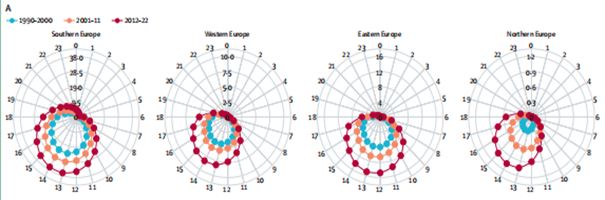
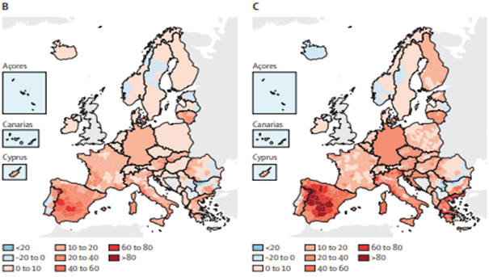
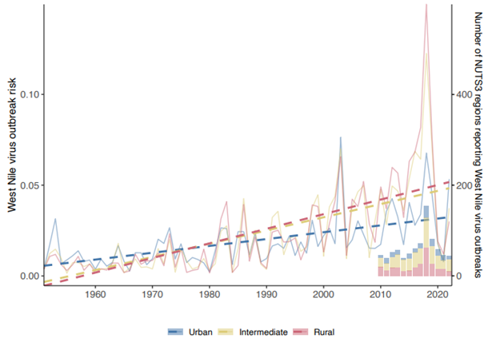

---
output:
  html_document: default
  pdf_document: default

---
<div style="page-break-before: always;"></div>

# Introduction

*Author: Yijie Chen*

*Supervisor:Helmut Küchenhoff*

```{r message=FALSE, warning=FALSE, include=FALSE}
library(bookdown)
library(svglite)
```

# 1 Introduction

Public health is at increasing danger from the effects of climate change-particularly heat-related effects on health and diseases which increase with rising temperatures. To identify the complex relationships connecting climate variables and human health is the key to effective intervention and prevention efforts. In recent years, both statistical and machine learning methods have been applied to quantify this relationship and forecast risks in future,Shang says.

This study examines the applications of a variety of methods to examine risks for climate-sensitive diseases that are influenced by temperature fluctuations. We apply some statistical methods, including splines and Generalized Additive Models (GAMs), as well as machine learning algorithms such as Gradient Boosting and XGBoost. These approaches enable us to model the nonlinear and intricately entwined relationships between different climate indicators, health outcomes, and socio-economic factors.

To illustrate the practical use of these methods, we present two case studies based on the 2024 Europe Report of the Lancet Countdown on Health and Climate Change [@vandaalen2024], with a regional focus on Europe. The first study investigates heat-related mortality, analyzing how temperature impacts human deaths, as previously demonstrated in a large-scale observational study [@gasparrini2015]. The second study examines the transmission risk of West Nile Virus (WNV), using predictive models informed by a combined dataset of climatic and socio-economic variables, with the modeling approach based on the XGBoost framework [@chen2016xgboost].

# 2 Background  
## 2.1 Climate and Public Health

Climate change is increasingly recognized as a major global driver of public health risks. Among climate-sensitive outcomes, two of the most pressing are heat-related mortality and the transmission of vector-borne diseases, such as West Nile Virus (WNV). Rising temperatures and more frequent heatwaves have been linked to excess mortality, particularly among vulnerable populations such as the elderly and individuals with pre-existing health conditions. At the same time, changes in temperature and precipitation patterns have affected the habitat and seasonality of disease-carrying vectors like mosquitoes, contributing to the spread of WNV in Europe. These public health threats have become a central focus in environmental epidemiology and climate-health research. For example, the 2024 Lancet Countdown report highlights the growing health burden of both heat exposure and infectious disease risk in the context of climate change [@vandaalen2024].

## 2.2 Related Literature
In addition to model flexibility and performance, interpretability plays a vital role in selecting suitable methods for public health applications. While traditional linear models often fall short in capturing the complex temporal dynamics of environmental exposure, the use of splines provides an elegant solution. Hansen et al. systematically outlined the theoretical foundation for spline-based modeling, emphasizing their ability to flexibly represent smooth functions while controlling for overfitting. This makes splines particularly suitable for applications where relationships between variables change gradually over time or vary across geographic regions.[@hansen2006]

Building on these developments, distributed lag non-linear models (DLNM) have emerged as a powerful approach for simultaneously modeling exposure–response and lag–response functions, especially in the context of climate-related health outcomes such as heat-related mortality. These models enable researchers to estimate both immediate and delayed effects of temperature, as demonstrated by Gasparrini et al. in a large-scale, multi-country analysis [@gasparrini2015].

Altogether, these methodological advancements—GAMs for flexible modeling, splines for smooth function estimation, DLNMs for time-varying effects, and XGBoost for classification in high-dimensional, imbalanced data—form a comprehensive analytical toolkit. They allow for a nuanced understanding of how climate variability translates into health risks, providing the basis for the two empirical applications explored in this report.
# 3 Theoretical framework

This section outlines the theoretical foundation of the statistical and machine learning methods used in this study. The aim is to model complex relationships and non-linear dependencies among health outcomes, climate indicators, as well as socio-economic variables.


## 3.1 Splines

Splines are flexible mathematical tools that model smooth nonlinear relationships across defined intervals. They are especially useful in health-related data modeling, such as temperature effects, due to their ability to control smoothness and avoid overfitting.[@hansen2006]

## 3.2 Generalized Additive Models (GAM)

Generalized Additive Models (GAMs) extend the classical Generalized Linear Models (GLMs) by incorporating smooth, non-parametric functions of predictor variables. This flexibility allows GAMs to capture complex, nonlinear relationships between predictors and the response variable, without requiring a strict parametric form. They are particularly valuable in environmental and public health contexts, where such relationships often evolve over time or vary across spatial or demographic dimensions.

The concept of GAMs was first formally introduced by Hastie and Tibshirani [@hastie1986], who proposed a statistical framework that combines the interpretability of linear models with the adaptability of smoothing splines and other basis functions. In their foundational work, they demonstrated how GAMs could be used to model structured nonlinearity while maintaining additive interpretability. Since then, GAMs have become a widely used tool in epidemiology, climate-health modeling, and beyond, especially when the assumption of linearity is inappropriate.


## 3.3 Gradient Boosting

Gradient Boosting sequentially adds weak learners to build predictive models. With each iteration, the algorithm fits a new learner to the errors remaining from what ensembles have been made so far--honing its overall model. This policy helps attenuate both the bias and variance of predictions, typically leading to improved prediction performance on structured data sets and the like.

## 3.4 XGBoost

XGBoost (Extreme Gradient Boosting) is a scalable and efficient tree boosting algorithm that performs second-order Taylor approximation and incorporates regularization to prevent overfitting. It is particularly effective for high-dimensional, structured data in health research.[@chen2016xgboost]

### 3.4.1 Modeling High-Dimensional Climate-Health Data

1. Climate Variables: Temperature, humidity and precipitation, which have a direct effect on mortality and disease transmission.

2. Bioclimatic Variables: Long-term climate trends relevant to vector-borne diseases.

3. Sociodemographic Data: For example population density, degree of urbanization, or economic metrics, revealing vulnerability and exposure from context.

### 3.4.2 Greedy Feature Selection 

XGBoost employs a greedy division method, using information gain to optimize decision trees: 
 Highly efficient in reducing forecast error and identifying the most relevant variables.


## 3.5 Lag Effects and CrossBasis Function

To account for the potential delayed effects of heat exposure on mortality, we introduced a lag structure in the modeling framework. Specifically, we used a cross-basis function, which allows for simultaneous modeling of both the exposure–response relationship and the lag–response relationship.

The temperature–mortality association was modeled using a natural cubic spline with internal knots placed at the 10th, 50th, and 90th percentiles of each region's weekly temperature distribution. The lag dimension was constructed using discrete lags at 0, 2, and 3 weeks, capturing both immediate and short-term delayed responses.

This cross-basis setup enhances the flexibility of the model in capturing the non-linear and cumulative nature of heat-related mortality. While the most substantial effects were typically observed in the immediate period (0–3 days), delayed impacts spanning up to several weeks were also evident, particularly in regions with sustained heat stress. The cross-basis approach is particularly valuable for identifying at-risk populations and informing time-sensitive public health interventions.

# 4 Application

## 4.1 Heat-related mortality

### 4.1.1 Data Description and Modeling Approach

Based on data from 1 January 2015 to 30 November 2022, this chapter is a systematic investigation into fatal ailments due to high temperature that took in 823 localities across 35 European countries. There were more than 45 million ciphered deaths in the study, among which over 22 million were female deaths and more than 21 million were of men. To capture the temperature–mortality relation, this study melds climate data, mortality data and demographic material into a coherent whole within the setting of statistics. Counted mortality data on a daily basis were taken from national sources, with population figures from Euro-stat. The temperature figures were derived from the ERA5-Land reanalysis data set which provided high temporal and spatial resolution suitable for impact studies in health. Merging those three data sets produced a pan-European mortality record that is standardized to population. To model temperature effects on mortality, a quasi-Poisson regression model was used. This approach can accommodate over-dispersion in count data and is therefore well suited to modelling mortality. In order to control for seasonality and long-term trends, a natural cubic spline of time with eight degrees of freedom per year was included. This adjustment ensures that the estimated temperature effects are not confounded by broader temporal fluctuations which are not climate related. Furthermore, as heat exposure may not have immediate mortality effects the model takes lag structures into account. Lag effects were estimated using a cross-basis function from a Distributed Lag Non-Linear Model (DLNM), which offers a joint modeling of exposure–response and lag–response relationship. A natural cubic spline is used to model the temperature effect, with internal knots placed at the 10th, 50th and 90th percentiles of the local weekly temperature distribution. The lag dimension was integrated to integer lags of 0, 2 and 3 weeks, allowing both immediate and later physiological effects of heat exposure to be captured. This provides a means for looking at the cumulative effects of heat across various time horizons. To quantify the burden of heat-attributable mortality, heat weeks were defined as those weeks in which the average daily temperature surpassed a region’s minimum mortality temperature. Then the heat-linked deaths were calculated as extra deaths per 100 thousand residents. These estimates were made separately for two reference periods: 2003-2012 and 2013 to 2022. Where data gaps are possible, imputation methods were used to ensure continuity of trends. In order to estimate the uncertainty around empirical mortality risk, Monte Carlo simulations were employed. This technique yields multiple draws from the distribution of model parameters, producing probabilistic confidence intervals for the estimated rates of heat-attributable mortality.

(ref:figRadar) Adapted from @vandaalen2024.

```{r radar_plot, echo=FALSE, out.width="100%", fig.cap="(**Abbildung 1**) Radar plots illustrating the 24-hour distribution of heat stress risk across Southern, Western, Eastern, and Northern Europe during three decades: 1990–2000, 2001–2011, and 2012–2022. (ref:figRadar)"}

```

### 4.1.2 result

Based on data from 1 January 2015 to 30 November 2022, this chapter is a systematic investigation into fatal ailments due to high temperature that took in 823 localities across 35 European countries. There were more than 45 million ciphered deaths in the study, among which over 22 million were female deaths and more than 21 million were of men. 

To capture the temperature–mortality relation, this study melds climate data, mortality data and demographic material into a coherent whole within the setting of statistics. Counted mortality data on a daily basis were taken from national sources, with population figures from Euro-stat. The temperature figures were derived from the ERA5-Land reanalysis data set which provided high temporal and spatial resolution suitable for impact studies in health. Merging those three data sets produced a pan-European mortality record that is standardized to population. 

To model temperature effects on mortality, a quasi-Poisson regression model was used. This approach can accommodate over-dispersion in count data and is therefore well suited to modelling mortality. In order to control for seasonality and long-term trends, a natural cubic spline of time with eight degrees of freedom per year was included. This adjustment ensures that the estimated temperature effects are not confounded by broader temporal fluctuations which are not climate-related. Furthermore, as heat exposure may not have immediate mortality effects the model takes lag structures into account. Lag effects were estimated using a cross-basis function from a Distributed Lag Non-Linear Model (DLNM), which offers a joint modeling of exposure–response and lag–response relationship. A natural cubic spline is used to model the temperature effect, with internal knots placed at the 10th, 50th and 90th percentiles of the local weekly temperature distribution. The lag dimension was integrated to integer lags of 0, 2 and 3 weeks, allowing both immediate and later physiological effects of heat exposure to be captured. This provides a means for looking at the cumulative effects of heat across various time horizons. 

(ref:figHeatMap) Adapted from @vandaalen2024.
```{r heat_map, echo=FALSE, out.width="100%", fig.cap="**Abbildung 2:** Heat-attributable mortality rates per 100,000 population across Europe, comparing two periods: 2003–2012 and 2013–2022 (ref:figHeatMap) ."}

knitr::include_graphics("2.png")
```

To quantify the burden of heat-attributable mortality, heat weeks were defined as those weeks in which the average daily temperature surpassed a region’s minimum mortality temperature. Then the heat-linked deaths were calculated as extra deaths per 100 thousand residents. These estimates were made separately for two reference periods: 2003-2012 and 2013 to 2022. Where data gaps are possible, imputation methods were used to ensure continuity of trends. In order to estimate the uncertainty around empirical mortality risk, Monte Carlo simulations were employed. This technique yields multiple draws from the distribution of model parameters, producing probabilistic confidence intervals for the estimated rates of heat-attributable mortality.

## 4.2 West Nile Virus

### 4.2.1 Data and Method

To estimate the probability of West Nile Virus (WNV) transmission, our study integrates three main categories of input: climate data, WNV infection records, and socioeconomic factors. Besides temperature and rainfall – two factors with significant impacts on mosquito ecology – another 19 bioclimatic variables are taken from the ERA5-Land reanalysis dataset. This gives information at a resolution of 0.1° if needed, sufficient to capture truly fine-grained geographic detail. Among the 19 bioclimatic variables are ones that pick out long-term climatic trends. It may be possible in future work to use these to model the spread of the WNV more accurately both in space and time. The Y variable is human WNV infection distribution-data obtained from the European Centre for Disease Prevention and Control (ECDC). The dataset covers 800 NUTS3-level administrative regions across Europe. Despite the territorial coverage, however, the data is extremely unbalanced: Only 4% of the regions report WNV positive detections while 96% do not. 

This affects the results of predictive models and special handling is necessary. The inclusion of socioeconomic information on the part of the human host is surely essential. Prompting these questions whether the environment of man, including land use zoning, urban development intensity (especially new urban area density), and overall economic situation (measured not just financially but from all angles: there are indicators that try to take in income, expenditure, investing practices) plays a role in West Nile Virus transmission. The influences for these socio-economic factors on someone living in habitations within 1 kilometer radius will in general differ over very short distances greater than 2 kilometers out from any given point of residence. The XGBoost method was used for the WNV risk model, a gradient boosting approach particularly well-suited to highly dimensional, imbalanced and symbolically labeled datasets. The data set was split temporally to evaluate model performance over different period.

Thus, it was used training data for 2010 to 2019 in order to allow the model to learn from recent infection trends. For testing data from 1950–2009 and 2020–2022 is used to reflect the model’s performance both backwards in time, and forward. This approach has the merit of ensuring that the model is reliable in discerning historical patterns and in forecasting future risks. Various strategies are employed by the models to tackle the serious class imbalance.

For one, it uses custom loss functions and class weighting to ensure that the minority class – regions with WNV infections – does not get swamped by the majority class. Hyperparameter tuning is performed to optimize the way decision trees are structured, enhancing the model’s ability to find rare events. Furthermore, the scale position weight parameter in XGBoost is adjusted to enhance sensitivity to WNV-positive cases. Together, all these strategies help the model to better differentiate high-risk regions – even in cases where positive cases are rare.

(ref:figWNVRiskTrend) Adapted from @vandaalen2024.
```{r wnv_risk_trend, echo=FALSE, out.width="100%", fig.cap="(**Abbildung 3**) Predicted West Nile Virus (WNV) outbreak risk from 1950 to 2022 across urban, intermediate, and rural areas. (ref:figWNVRiskTrend)"}

```

### 4.2.2 Results

The model outputs confirm that WNV outbreak risk is increasing across Europe, with rural regions being most affected. This finding aligns with previous observations that rural and intermediate areas are more prone to outbreaks due to favorable environmental conditions for mosquito breeding and virus transmission. The model effectively captures historical outbreak trends, providing evidence for its reliability in forecasting future WNV risk. Climate change and related environmental factors appear to play a critical role in shaping these risks.

Results further demonstrate a consistent rise in WNV risk across the decades from 1950 to 2022. The sharp increase in predicted risk after the year 2000 supports the hypothesis that rising temperatures and altered precipitation patterns have contributed to an expanded range of the virus. Rural and semi-urban regions show particularly elevated risks, suggesting that these areas may require targeted surveillance and intervention.

Importantly, model predictions closely align with observed data, strengthening the credibility of the XGBoost model. By successfully reproducing known outbreak distributions, the model not only validates its approach but also highlights the strong connection between climatic variables and WNV transmission. The combination of temperature, precipitation, and bioclimatic indicators, along with socioeconomic context, emerges as a powerful framework for understanding viral spread.

Beyond modeling accuracy, the findings have important implications for public health planning. They highlight the need for enhanced disease surveillance and the development of early-warning systems in high-risk regions. Furthermore, climate-adaptive intervention strategies should be prioritized to address the growing influence of environmental change on vector-borne diseases. By linking long-term climate trends to outbreak risk, the study underscores the urgency of proactive and climate-informed public health measures

# 5.Conclusion

This study has explored the intersection of climate change and public health by examining two critical dimensions of climate-related health risks in Europe: heat-related mortality and the spread of West Nile Virus (WNV). Drawing on a combination of statistical modeling and machine learning techniques, the analysis aimed to capture the nonlinear, delayed, and regionally varying nature of these impacts.

In the first part of the study, we discussed heat-related mortality, drawing on findings from previous literature that analyzed temperature–mortality relationships using quasi-Poisson regression combined with distributed lag non-linear modeling (DLNM). This approach, as shown in the work of Gasparrini et al. [@gasparrini2015], allows for the estimation of both immediate and delayed mortality effects of high temperatures. These findings highlight the increased health burden associated with heat, particularly in Southern and Western Europe, and among vulnerable subgroups such as the elderly and women. The analysis illustrates how mortality patterns can evolve over the course of a heatwave, underscoring the need for timely public health interventions.

In the second part of the study, we assessed the spatial risk of WNV transmission using XGBoost, a tree-based gradient boosting algorithm well-suited for high-dimensional and imbalanced data. By incorporating climate, bioclimatic, and socioeconomic variables, the model effectively identified regions at elevated risk and aligned well with historical outbreak trends. The results show a rising trend in WNV risk, especially after 2000, with rural and semi-urban areas emerging as key hotspots. These findings reinforce the importance of integrating climate data into infectious disease monitoring and forecasting systems.

Together, these two case studies illustrate the value of combining traditional epidemiological approaches with modern machine learning tools to study climate-sensitive health outcomes. They also underscore the growing urgency of public health adaptation in response to climate variability. As global temperatures continue to rise, the capacity to detect, predict, and respond to climate-related health threats will become increasingly vital.

Future research should build upon this work by incorporating additional climate-sensitive diseases, refining spatial and temporal resolutions, and extending the analysis to non-European contexts. Moreover, the integration of early warning systems with public health infrastructure will be essential for mitigating the adverse effects of climate change on human health. By advancing our understanding of climate-health interactions, this study contributes to the broader goal of building more resilient and adaptive public health systems in the face of global environmental change.
